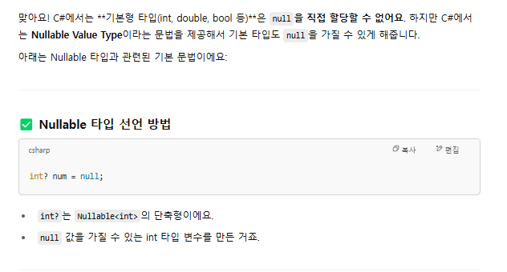
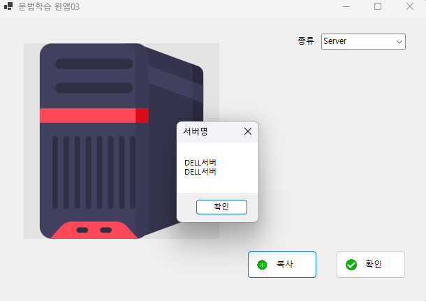

# iot_csharp_winapp_2025
C# /윈도우 애플리케이션

|실행|키|
|:--:|:--:|
|코드보기|F7|
|디자이너보기|SHIFT + F7|
|파일1개 저장|CTRL + S|
|파일전체 저장|CTRL + SHIFT + S|
|복사|CTRL + C+ V |
|그룹복사|2개이상의 컨트롤 + CTRL + 드래그|
|생성자,<br>함수오버라이딩 자동생성,<br>불필요한 using제거|Alt + Enter|
## 54일차 (4/18)

### C# 시작전에
- repository만들기
    - gitignore을 visualstudio로
    - 
- visual studio installer 확인
    - `ASP.NET 및 웹 개발, .NET 데스크톱 개발은 필수!`
    - python 개발, Node.js개발도 추가!
    - .NET Multi-Platform App UI 개발은 옵션!
    - 

### C# 학습
#### C#이란?
- C#  : **마이크로소프트**가 개발한 객체지향 프로그래밍 언어
    - 1991년, 귀도 반 로섬이 Python 개발
    - 1985년, 비야네 스트롭스트룹이 C++을 개발(너무 어려움, 1980년 초반 개발시작)
    - 1995년, 제임스 고슬링이 Java를 개발(C++의 문법을 기반, 좀 더 쉬운 언어, 1991년 개발 시작)
    - MS가 썬 마이크로시스템즈와 라이센스 채결 후 MS용 Java인 J++개발. 특허권 소송 발생
    - 1999년, 파스칼, 델파이를 개발한 `엔더스 헤일스버그`가 C++,Java를 기반으로 C#개발
    - 2000년, C# 발표

- C# 특징
    - 닷넷 플랫폼 위에서 동작(Managed C++ , C#, Java, Python, ...)
    - 문법이 Java와 상당히 유사
    - Java와 달리 unsafe mode를 사용하면 C/C++포인트 기능을 사용 가능
    - 런타임 시 **쓰레기 수집(Garbage Collection)**으로 자동으로 메모리 관리
- C# 유머
    - 1999년 앤더스 헤일스버그가 최초 Cool(C-like Object Oriented Language)로 이름을 생성
    - C#의 의미는 C++보다 개선된 언어의 의미로 C++++ , 또는 음악에서 #이 원래 음보다 반음 높음을 뜻

- C# 버전
    - C# 1.x - 2002~2003년, .NET Framework 1.x ,  문제많음
    - C# 2.x - 2006년, .NET Framework 2.x , 개선이 많이 됨
    - C# 3.x - 2007년, .NET Framework 2.x ~3.5, Java와 차이가 많아짐
    - C# 4.x - 2010년, .NET Framework 4.x, C#의 기반 
    - ...
    - C# 6.x - 2015년, .NET Framework 4.6 , .NET Core 1.x (리눅스) 
    - C# 7.x - 2017~2018년, .NET Framework 4.7 , .NET Core 2.x
    - ...
    - C# 9.0 - 2020년 , **.NET 5.0(Framework와 Core 통합)**
    - C# 10.0 - 2021년, .NET 6
    - C# 11.0 - 2022년, .NET 7
    - C# 12.x - 2023년 , .NET 8
    - C# 13.x - 2024년 11월 , .NET 9(visual studio 2022에서 동작)

- 호환성, 범용성
    - 초기 Window OS에서만 동작, OS플랫폼 독립적인 Java보다 범용성이 낮았음
    - 2016년부터 리눅스 공식지원. macOS에서도 사용 가능. 오픈소스 공표
    - 유니티 엔진 기본언어, Xamarin(이후 MAUI로 변경)로 모바일 개발 가능
    - 리눅스 Mono라는 닷넷 개발 프로젝트 -> 후에 MS에 흡수됨

#### .NET Framework(.NET)
- CLR(Common Langauage Runtime) 클래스를 사용하는 가상 머신
- Java와 JVM과 유사한 개념
- 언어가 발전하면서 필요한 기능이 늘기 때문에 .NET Framework도 버전업을 계속함
- 2015년 리눅스 지원 개발시부터 .NET Framework가 너무 윈도우 구조에 토착되다보니 새로운 프레임워크가 필요함
- .NET Core - 리눅스 지원용 만든 .NET[Framework]
- .NET Core와 .NET Framework가 혼용
- 2020년 .NET Core와 .NET Framework를 통합해서 .NET 5.0 공표 . 이 이후부터 Framework, Core 이름 사라짐
- C# 버전과 .NET 버전 숫자 차이가 나기 시작

- .NET 데스크톱 개발을 설치하면 C# , Visual Basic, F# 등 여러언어를 사용가능
- **C# 12.0 , .NET 8 , Visual Studio 2022 Community Edition에서 학습**

#### 첫번째 실행파일 실습 [c#](./day54/FirstCsharpApp/Program.cs)
1. 새 프로젝트 만들기 - c# 모든 플랫폼 콘솔 - 콘솔앱 - 프로젝트이름 및 위치 - 프레임워크 .NET 8.0  및 최상위 문 사용 안 함 체크 
2. 확장자가 .cs인 파일
    ```cs
    namespace FirstCsharpApp
    {
        internal class Program
        {
            static void Main(string[] args)
            {
                Console.WriteLine("Hello, World!");
            }
        }
    }
    ```
    - 
    - 
    - 
3. 주의할점
    - 
4. Java와 C# 비교
    - 
    - 

## 55일차 (4/21)
- WinApp으로 문법 학습. 문법 학습 후 WPF로 이전
### 새 프로젝트(콘솔) 만들기
1. 선택
    - 언어 : c# 
    - 플랫폼 : 모든 플랫폼
    - 프로젝트 :  콘솔/데스크톱/웹 중 콘솔
2. 새프로젝트 구성
    - 콘솔앱
    - 프로젝트 이름 및 위치, 솔루션 이름
    - 솔루션 및 프로젝트를 같은 디렉토리에 배치 체크박스`해제` : 솔루션 내에 여러 프로젝트를 관리
3. 추가정보
    - 프레임워크 :.NET 8.0 (장기지원) 선택
    - 최상위 문 사용 안 함 `체크`


### 새 프로젝트(데스크톱,WinApp) 만들기
- 아직 멀티플랫폼은 지원 안됨(Windows만 지원)
- Windows Forms앱(문법학습 시에만 사용할 예정) - 가장 오래된 WinApp개발
- WPF (실습할 때 사용할 예정)- 좀 더 디자인적으로 뛰어난 WinApp개발
1. 선택
    - 언어 : c# 
    - 플랫폼 : 모든 플랫폼
    - 프로젝트 : 데스크톱
2. 새프로젝트 구성
    - Windows Forms앱
    - 프로젝트 이름 및 위치, 솔루션 이름
    - 솔루션 및 프로젝트를 같은 디렉토리에 배치 체크박스`해제` : 솔루션 내에 여러 프로젝트를 관리
3. 추가정보
    - 프레임워크 :.NET 8.0  (장기지원) 선택
    - 최상위 문 사용 안 함 `체크`

- 프로젝트 구조
    - 종속성:필요모듈 추가/관리/삭제
    - Form1. cs : 윈폼 앱 개발 로직
    - Form1.Designer.cs : 실제 디자인 요소
    - Form1.resx : 아이콘, 이미지, 리소스문자열 관리 파일
    - Program.cs : 시작 프로그램 소스

### 솔루션 관리
- 하나의 솔루션에 여러개 프로젝트가 있으면 시작프로젝트가 선별되어야 함
- 굵은 글씨체로 나오는 프로젝트가 시작 프로젝트

1. 프로젝트 오른쪽 마우스-시작프로젝트로 설정
2. 솔루션 오른쪽 마우스- 시작프로젝트구성- 한개의 시작프로젝트 - 시작프로젝트 고르기
    - 

- 전체솔루션 : *.sln
    - C# 프로젝트 파일 : *.csproj
    - C++ 프로젝트 파일 : *.vcxproj
- debug/release 모드
    - debug - 개발시 사용 모드, 디버깅 로그, 디버깅을 위주
    - release - 배포시 사용 모드, 프로그램 최적화, 성능 업

### WinForm 앱 개발 순서
1. Form1.cs 이름 변경 (F2): FrmMain.cs
    - 변경시 모든 참조 이름도 바꾸시겠습니까? 메시지창
    - 반드시 예 선택
2. FrmMain.cs [디자인] 
    - 마우스로 크기조정
3. 속성 창 (F4) , 솔루션 탐색기 아래쪽으로 드래그 후 붙이기
4. PyQt Designer와 거의 유사
    - FrmMain 속성 창 > Text 
    - size속성 > Width, Height
    - StartPosition > CenterScreen으로 변경
    - MaximizeBoxe > False      # 최대화 버튼 비활성화
    - FormBorderStyle >FixedSingle로 변경  # 사용자가 창 크기를 조절 못 하게 만들고  얇은 단일 실선 테두리만 남겨
5. 보기 >도구상자
    - 공용컨트롤 > button 드래그
6. 속성 창 - 드롭다운 컨트롤 > 여러 클래스 리스트
7. button1 속성 변경
    - (Name) -> button1 을 BtnMsg로 변경
    - size조정
    - text > button1 을 메시지로 변경

8. 중간마다 ctrl +S 눌러서 저장 습관
9. 이벤트방법(1) 속성 창의 이벤트아이콘(번개표시) 클릭
    - click에 선택되어 있음
    - 버튼의 경우, 버튼클릭이 기본 이벤트
    - click 오른쪽 빈공간을 더블 클릭
    - 버튼을 클릭했을 시 처리할 이벤트 메서드가 자동 생성

10. 이벤트방법(2) 새로 만든 컨트롤을 더블클릭
    - 이벤트 메서드가 자동생성
    - 최초에 아무런 이벤트가 없을 때 기본 이벤트 메서드 생성
11. 오류 발생 시
    - 폼 디자인의 컨트롤 이벤트와 로직 코드 상의 이벤트 처리 메서드 생성 상 불일치
    - 이벤트 이름은 생성되고, 이벤트 정의 메서드는 생성이 안되어서
    
    - FrmMain.Designer.cs파일 오픈 후 오류난 이벤트 이름 삭제
12. MessageBox.show() 작업
    - MessageBoxIcon.Warning
    - MessageBoxIcon.Error 사용시 알람 사운드 발생
    ```cs
          // 메시지 박스에 표시될 내용,메시지 박스의 제목,MessageBoxButtons.OK는 메시지 박스에 표시될 버튼 종류,메시지 박스에 표시될 아이콘
      MessageBox.Show("첫번째메시지" , "알림", MessageBoxButtons.OK,MessageBoxIcon.Error);
    ```
    - `MessageBox.Show()는 string을 받아야 하니까, .ToString()을 써야 해`
    - MessageBox.show()  오버로딩
        - 
13. **폼 디자이너 화면과 코드 상 전환**
    - **F7 코드보기**
    - **SHIFT F7 디자이너 화면 보기**

14. VS에서 더블클릭 함부로 하지 말 것!
    - 이벤트 메서드 생성, 컨트롤 자동 생성, 폼 디자인 표시 등에서만 더블클릭 사용

15. 두 개 이상의 컨트롤 선택 후 CTRL 키 누른 상태에서 드래그하면 그룹으로 복사
### 윈앱 컨트롤 [C#](./day55/Day02Study/SyntaxWinApp03/FrmMain.cs)
- Button : 마우스 클릭위한 컨트롤
    - 보통 Btn으로 시작
    - (Name) : 소스코드상에서 접근,사용
    - Enabled : 사용여부
    - location : 폼상의 위치(x,y)
    - Size : 버튼 크기 (w, h)
    - Text : 버튼 표시 글씨
    - Visible : 화면 표현 여부
    - TabIndex : 실행 후 탭으로 포커스가 가는 순서(레이블에는 포커스 안감)
    - image : flaticon에서 png파일 24px로 다운받아 넣기 
        - imageAlign : MiddleLeft로 하기
        - 
        - FrmMain.resx에 png파일이 들어간 것을 확인할 수 있음
    - (이벤트)Click : 버튼 클릭 이벤트 처리 메서드 연결
- Label : 화면상의 글자만 표현하는 컨트롤
    - 보통 Lbl로 시작
    - Button 컨트롤과 속성은 동일
    - Label은 이벤트 거의 사용하지 않음
- TextBox : 텍스트 입력을 위한 컨트롤
    - 보통 Txt로 시작
    - Button 컨트롤과 속성은 동일
    - Multiline : 여러줄 사용여부 .true가 되어야 높이 조절 가능
    - MaxLength : 최대 몇자까지 적을 수 있는지
    - PlaceholderText : 입력 전 입력내용 표시
    - ReadOnly : 입력 가능 여부 . True는 입력불가
    - BorderStyle : 각 컨트롤의 테두리 속성 변경
        - None  : 테두리 없음
        - FixedSingle : 검은색 테두리
        - Fixed3D : 입체감 있는 테두리
    - PasswordChar : 들어가는 텍스트를 암호처럼 숨길 때 사용. 보통 ㅁ한자키 특수문자● 사용
    - (이벤트)TextChanged : 글자가 변경되면 발생하는 이벤트
    - (이벤트)KeyPress : 키보드 입력이 생기면 발생하는 이벤트 
- ComboBox : 여러 개 중 아이템을 선택하는 컨트롤 . 기본적으로 단일 선택만 가능합니다. 
    - 보통 Cbo로 시작
    - Button 컨트롤과 속성은 동일
    - Items(Collection) :필요한 아이템 할당
    - (이벤트)SelectedIndexChanged : 선택한 아이템 순번이 바뀔 때 발생하는 이벤트
    - (이벤트)SelectedValueChanged : 선택한 아이템 값이 바뀔 때 발생하는 이벤트
- RadioButton : 여러 개 중 하나만 선택하는 컨트롤
    - 보통 Rdo로 시작
    - Button 컨트롤과 속성은 동일
    - Checked : 체크여부
### C# 문법 
- 문법 - C++, Java와 거의 동일 . C++와의 차이점
    1. 기본구조 및 주석 [C#](./day55/Day02Study/ConsoleApp1/Program.cs)
        - 한줄 주석 //
        - 여러줄 주석 /**/
        - XML 주석 ///   - 소스코드 자동 문서 생성 시 사용하는 주석
    2. 자료형과 변수 , Nullable [C#](./day55/Day02Study/SyntaxWinApp01/FrmMain.cs)
        - 변수 사용은 C++과 유사
        - 자료형도 C++과 유사, 닷넷타입은 차이있음
        - `닷넷타입`은 여러언어에서 공통으로 사용위해서 추가된 기능
            - 
        - `Nullable`: 특수타입. 데이터타입 뒤에 ? 추가.
            - 
        - `var` 타입: 지역변수에서 타입을 동적으로 지정할 때
            - 한 번 타입이 정해지면 그 타입은 고정입니다.
            - 지역변수만 가능
            - 
            - 

    3. 연산자  [C#](./day55/Day02Study/SyntaxWinApp02/FrmMain.cs)
        - C와 C++와 동일
        - C#에서 불린형은 true, false이지만 
        - 메시지박스에서 .toString()으로 출력할 때는 True, False이다.
        - 

    4. 분기문, 반복문 [C#](./day55/Day02Study/SyntaxWinApp03/FrmMain.cs)
        - if문
        - switch문
        - for문
        - while문
            - 무한반복문 윈앱 종료하는 법 : ctrl shift esc - 작업관리자 오른쪽 마우스 세부내용보기 - 프로젝트명(예-SyntaxWinApp03) 작업끝내기
        
        
## 56일차(4/22)
### 한글문제
- 콘솔 > Program.cs : UTF8 BOM 저장
- 윈앱 > FrmMain.cs : EUC-KR (CP949) ->깃허브에서 한글이 깨져서 나옴
1. vscode에서는 오른쪽 하단 상태표시줄 UTF-8 클릭 > 인코딩 하여 다시 열기( EUC-KR) 또는 인코딩하여 저장 실행
2. visual studio 2022에서는  다른이름으로 저장 - 인코딩하여저장 - UTF8
3. C:\Source\iot_csharp_winapp_2025\.git (보기-숨긴표시보기)  > config파일 > 아래 코드 추가 후 저장
    ```ini
    [i18n]
        commitEncoding = utf-8
        logOutputEncoding = utf-8
    ```
### 윈앱 컨트롤 2
- 모든 컨트롤은 Control 클래스를 상속
- maskedTextBox : 사용자에게 주어진 형태로만 입력을 하도록 강제하는 텍스트입력 컨트롤
    - 텍스트박스와 동일하게 Txt로 시작
    - Button 컨트롤과 속성 동일
    - Mask : 사용자에게 입력제약할 포맷
- groupBox : 관련있는 컨트롤들을 묶어주는 컨트롤
    - (Name)을 거의 바꾸지 않음
    - Button 컨트롤과 속성 동일
    - 정렬은 흰네모 기준임
        - 
- Button 이미지 추가
    1. 속성 Image - 리소스 선택- 로컬리소스 -  가져오기
    2. `도구상자- 구성요소- ImageList 컨트롤 드래그`
        - 폼에 표현되는 컨트롤이 아님 
        - 이미지 사이즈를 개발자가 조정가능(1~256)
        - 
        - 
    3. 프로젝트명 - Properties - Resource.resx 
    4. 솔루션탐색기 > 추가 > 새폴더 > Resources 폴더 생성
        - **이미지 선택 - 속성- 출력 디렉토리 복사- 항상 복사- 빌드**
        -    
- PictureBox : 이미지를 표현해주는 컨트롤       
    - 보통 Pic로 시작
    - BorderStyle : 보통 None
    - BackColor : 폼색과 다르게 해서 영역 표시
    - Image : 표시할 이미지 선택
    - SizeMode : 들어가는 이미지 사이즈 형태
        - Normal : 큰이미지는 잘려서 나옴
        - StretchImage : PictureBox Size에 맞춰서 표시
        - AutoSize : 자동사이즈
        - CenterImage : 작은 이미지를 중앙에 표시
        - Zoom : 확대
    -  
    -  
### 윈앱 개발기능
1. Debug - 디버깅시 필요한 기능 담은 클래스
    - Debug.WriteLine() : 디버그 - 창- `출력`에 디버깅 로그 출력
    - 디버깅 시작으로 실행 시만 출력
2. 프로젝트명 오른쪽 마우스- 속성(R) - 애플리케이션- 출력유형- 콘솔애플리케이션으로 변경 - cs파일에 console.WriteLine()으로 코드 수정
### C# 문법 
5. 문자열 처리 [C#](./day56/Day03Study/SyntaxWinApp01/FrmMain.cs)
    - 문자열 포맷팅 $""
    ```cs
     TxtResult.Text = $"저는 {name}이고, {birthday:yyyy-MM-dd}일에 태어난 {age:F2}살 {gender}자입니다.";
    ```
    
6. 클래스와 객체, 메서드 [C#](./day56/Day03Study/SyntaxWinApp02/FrmMain.cs)
    - 프로젝트명 오른쪽 마우스-추가-클래스-클래스명 작성 후 저장
    - **alt + enter 눌러서 생성자, 재정의함수 자동 생성**
    - 클래스 생성자,멤버변수,멤버함수 [C#](./day56/Day03Study/SyntaxWinApp02/Person.cs)
    ```cs
    public Person(){}

    public Person(string name, int age, char gender, string phone){
        Name = name;
        Age = age;
        Gender = gender;
        Phone = phone;
    }

    public string Name { get; set; } // getName(), setName() 자동 생성
    public int Age { get; set; }
    public char Gender { get; set; }
    public string Phone { get; set; }

    public  override string ToString(){
        return $"Name|Age|Gender|Phone\r\n" + 
                $"{Name}|{Age}|{Gender}|{Phone}"
    }
    ```
    - 
    - static : 객체를 생성하지 않고 바로 쓸 수 있음
    - get, set :
        ```cs
        private int age;         // 내부에서 값을 저장할 진짜 변수 (직접 접근 불가)
        public int Age {
            get { return age; }  // 외부에서 Age 읽을 때 실행
            set 
            { 
                if( value <0 || value >20)
                {
                    age = 20;
                }
                else
                {
                    age = value;
                }
            }
        }
        ```
7. 접근제어자
    - private : 클래스 내에서만 접근 가능
    - public : 어디서나 접근 가능
    - protected : 내부, 자식 클래스에서만 접근 가능
    - internal : 동일한 네임스페이스에서 public 기능
    - internal protected : 동일한 네임스페이스에서 protected 기능
    - internal은 최근에 자동생성에서 자주 사용되고 있음

8. 상속, 다형성 , 추상클래스, 인터페이스 [C#](./day56/Day03Study/SyntaxWinApp03/FrmMain.cs)
    - Java는 한 파일에 한 클래스 선호
    - C#은 한 파일에 클래스 여러개 생성 무방
    1. 상속
        - System.Object : 모든 클래스의 조상
        - 부모 생성자 호출 후 자식 생성자 호출
        - 부모 클래스에 자식 클래스 할당 가능(업캐스팅)
        - 부모 클래스에서 internal이 아닌 sealed는 더이상 상속하지 못함.
        ```cs
        internal class Computer
        {
            public Computer() {

                Debug.WriteLine("[디버그]Computer 객체 생성됨");
            }
        }

        internal class NoteBook : Computer {

            public NoteBook()
            {
                Debug.WriteLine("[디버그]NoteBook 객체 생성됨");
            }
        }
        ```
        ```cs
        Computer myNotebook = new NoteBook();
        ```
        - 
        - 부모는 자식함수 쓸 수 없다.자식은 부모함수 쓸 수 있다.
        ```cs
        myComputer.HasFingerScanDevice();   //부모는 자식함수 쓸 수 없다.
        myNoteBook.Boot();   //자식은 부모함수 쓸 수 있다.
        ```
        - is (객체타입 비교), as(형변환 키워드)
            ```cs
            //부모클래스를 자식클래스로 형변환하면서 문제 발생 
            //NoteBook myNoteBook2 =(NoteBook) new Computer();

            Computer myComputer2 = new NoteBook();
            if (myComputer2 is NoteBook) {
                Debug.WriteLine("myComputer2는 NoteBook입니다");
                NoteBook myNoteBook2 = myComputer2 as NoteBook;
                Debug.WriteLine("myComputer2을 myNoteBook2로 변경");

            }
            ```
            
        - this : 클래스 자신 . 현재는 사용 권장 안함.
        - base : 부모클래스 지칭. 현재는 사용 권장 안함.
        ```cs
            
        internal class Computer
        {
            public void Boot() 
            {
                Debug.WriteLine("컴퓨터 부팅!");
            }
       
        }

        internal class NoteBook : Computer {

            public NoteBook()
            {
                Debug.WriteLine("[디버그]NoteBook 객체 생성됨");
                base.Boot();
            }
        }
        ```
        
    2. 다형성 - 오버라이드
        - 오버라이드 : 부모 메서드를 재정의
            - 추상 : 대략적인 틀만 가지고 있음. 실행할 수 있는 능력부여
            - **부모클래스 함수에는 virtual 키워드**
            - **자식클래스 함수에는 override 키워드**
            ```cs
            internal class Computer
            {
                 public virtual void ShutDown() {
                    Debug.WriteLine("컴퓨터 ShutDown!");
                }
            }

            internal class NoteBook : Computer 
            {
                //부모 클래스 ShutDown()을 자식에서 다시 재정의
                public override void ShutDown() {
                    Debug.WriteLine("노트북 ShutDown!");
                }
            }
            ```
    3. 다형성 - 오버로드 : 같은 메서드를 여러 번 사용
    4. 추상클래스
        - 공통적인 기능은 직접 구현하고, 나머지는 자식이 구현하도록 맡기자!
        - 선언도 가능하고 정의도 가능함(일부 메서드는 정의(구현)하고, 일부는 선언만 해둘 수 있음)
        - 인스턴스 생성 불가능 (new로 못 만듦)
        - 인스턴스는 못 만들지만, 상속을 통해 사용되는 클래스
        - abstract 메서드는 자식이 반드시 오버라이드해야 함
        ```cs
        abstract class Animal
        {
            public abstract void MakeSound(); // 구현 X
            public void Sleep() {
                Console.WriteLine("쿨쿨 자요");
            }
        }

        class Dog : Animal
        {
            public override void MakeSound() {
                Console.WriteLine("멍멍!");
            }
        }

        // Animal a = new Animal();  오류! 추상 클래스는 인스턴스 생성 불가
        Dog d = new Dog();           // 가능!
        d.MakeSound();               // 출력: 멍멍!
        d.Sleep();                   // 출력: 쿨쿨 자요
        ```
    5. 인터페이스 
        - 계약관계 정의하고 구현없이 선언만 포함한 클래스의 일종
        - 추상클래스를 개선한 방법
        - 다중 상속을 방지하기 위해서 인터페이스 사용
        - 보통 I인터페이스명 형태로 명명
        - 내부 메서드만 존재. 형태만 구성(구현x)
        - 인스턴스 생성 불가능 (new로 만들 수 없음)
        - 다중 상속 가능 (인터페이스 여러 개 상속 가능)
        - 상속 시 구현 의무:자식 클래스는 모든 메서드를 반드시 구현해야 함
        - 기본적으로 붙는 키워드:	public abstract (생략되어 있음)
        - 필드/생성자 없음 (변수, 생성자 둘 다 X)
        ```cs
        // Dog 클래스는 인터페이스 2개를 동시에 상속받고
        //모든 메서드를 직접 구현해야 합니다
        interface IAnimal
        {
            void Eat();          // 선언만
            void MakeSound();    // 선언만
        }

        interface IWalkable
        {
            void Walk();         // 선언만
        }

        class Dog : IAnimal, IWalkable
        {
            public void Eat() {
                Console.WriteLine("냠냠");
            }

            public void MakeSound() {
                Console.WriteLine("멍멍!");
            }

            public void Walk() {
                Console.WriteLine("걷는 중");
            }
        }
        ```
    6. 함수오버라이드 , 함수오버로드 정리
        - 
        - 
    7. 다중상속 
        - 하나의 클래스가 두 개 이상의 클래스로부터 상속받는 것
        -  C++, Python에서는 가능함
        ```C++
        class A {
            void MethodA() { }
        }

        class B {
            void MethodB() { }
        }

        class C : public A, public B {
            // A와 B의 모든 멤버를 상속받음
        }
        ```
        ```python
        class A:
            def greet(self):
                print("Hi from A")

        class B:
            def greet(self):
                print("Hi from B")

        class C(A, B):  #  다중 상속 가능
            pass

        c = C()
        c.greet()  # ⚠️ 출력: Hi from A → Python은 왼쪽 우선 (MRO)

        ```
        - C#, Java에서는 다중 클래스 상속이 불가능함
        ```cs
        class A { }
        class B { }

        // 오류: C#은 클래스 다중 상속 금지
        class C : A, B { }
        ```
        - C#, Java에서 인터페이스로 다중 상속 가능
        ```cs
        interface IFlyable {
            void Fly();
        }

        interface ISwimmable {
            void Swim();
        }

        class Duck : IFlyable, ISwimmable {
            public void Fly() {
                Console.WriteLine("날아요!");
            }

            public void Swim() {
                Console.WriteLine("수영해요!");
            }
        }
        ```
        ```java
        interface Flyable {
            void fly();
        }

        interface Swimmable {
            void swim();
        }

        class Duck implements Flyable, Swimmable {
            public void fly() { System.out.println("날아요"); }
            public void swim() { System.out.println("수영해요"); }
        }
        ```
    8. 얕은 복사, 깊은 복사
        - 얕은 복사
            ```cs
            private void BtnCopy_Click(object sender, EventArgs e)
            {
                Server server1 = new Server();
                server1.Name = "HP서버";
                
                Server server2 = server1;
                server2.Name = "DELL서버";

                MessageBox.Show($"{server1.Name}\r\n{server2.Name}", "서버명");
            }
            ```
            - 
        - 깊은 복사
            ```cs
            public Server DeepCopy()
            {
                Server tmp = new Server();
                tmp.Name = this.Name;
                tmp.storage = this.storage; // 누락됐던 부분 추가
                return tmp;
            }
            ```
            ```cs
            private void BtnCopy_Click(object sender, EventArgs e)
            {
                Server server1 = new Server();
                server1.Name = "HP서버";
                
                //깊은복사
                Server server3 = server1.DeepCopy();
                server3.Name = "INTEL서버";
                Debug.WriteLine($"참조비교결과:{server1.Equals(server3)}");
                MessageBox.Show($"{server1.Name}\r\n{server3.Name}", "서버명");
            }
            ```
            - 
    9. Java와 C#에서의 ==, equals
        - 
        - 
    10. ret, out 키워드
    11.  열거형
## 57일차(4/23)
### VS 개발팁
- 코드조각(Code Snippt)을 최대한 활용(코딩양 줄임, 오타 예방)
    - try 적고 try 선택 + 탭2번 => try catch
    - try 적고 tryf 선택 + 탭2번  =>try finally
- 보기>개체 브라우저에서 필요한 클래스 검색
- 소스코드가 회색으로 연하게 변하는 것은 되도록이면 사용을 피하라는 뜻 -> alt enter로 변경사항 확인
### 윈앱 컨트롤 3
- NumericUpDown : 숫자를 입력을 도와주는 컨트롤
    - Nud 이름으로 시작
    - Button 컨트롤 속성과 동일
    - Minimum, Maximum : 입력최소값, 입력최대값
    - value : 현재값
    - 이벤트 생성 거의 안 함 
- 대부분 컨트롤 속성
    - Anchor : 현재 컨트롤을 어디에 고정시키는지 설정
        - 왼쪽 상단 컨트롤 : LEFT, TOP
        - 오른쪽 하단 컨트롤 : RIGHT, BOTTOM
    - Dock : 어디 도킹시키는지 설정
        - TOP, LEFT, RIGHT, BOTTOM , FILL
        - 보통 컨테이너 컨트롤용(예-그룹박스)으로 사용
    - Anchor랑 Dock을 같이 사용해서 디자인
    - Font : Form 속성에서 변경 시, 하위컨트롤들도 같이 변경된다.

- 이미지 파일
    1. 구성요소- ImageList 
        - 로컬이미지에서 가져오기,이미지크기 조정 
        - 컨트롤속성에 imageList, imageIndex가 있는 경우 사용가능(예: ListView, TreeView, Button, ToolStrip)
    2. 공용컨트롤-PictureBox
        - 로컬이미지/Resources.resxd에서 가져오기 . Pic.Image = Resources.girl;
    - Resources폴더 만들기-이미지 속성에서 출력 디렉터리로 복사를 항상복사  - 빌드 => 로컬이미지 가져오기할 때 이곳에서 한꺼번에 가져오면 되어서 편리
- RichTextBox : 포맷팅이 가능한 텍스트 박스
    - MS Word, 한글워드프로세서 같은 문장 꾸미기, 페이지 꾸미기 등이 가능
    - 마우스 휠로 Ctrl 키와 함께 글자 확대/축소가 되는 건 기본적으로 지원되는 기능
    - Rtb로 시작
    - ScrollBars : 컨트롤 오른쪽, 하단에 스크롤바 생성 . 보통 ForcedBoth, ForcedVertical 설정함
    - WordWrap : 컨트롤 길이를 넘어가면 자동으로 줄바꿈 여부. true면 자동줄바꿈
- 도구상자-대화-OpenFileDialog 컨트롤 : 읽을 파일 위치와 파일을 선정하는 다이얼로그 창 컨트롤
    - 폼위에 표시되지 않는 컨트롤
    - DlgOpen 이름으로 사용
- 도구상자-대화-SaveFileDialog 컨트롤 : 저장 위치에 파일명 지정하는 다이얼로그 창 컨트롤
    - DlgSave 이름으로 사용
### C# 문법
1. 형변환  [C#](./day57/Day04Study/SyntaxWinApp01/FrmMain.cs)
- 큰바이트 데이터형에 작은바이트 데이터형 값을 할당하면 문제없이 사용가능(묵시적 형변환)
- 작은바이트 데이터형에 큰바이트 데이터형 값을 할당하면 문법적 오류 => 명시적형변환으로 해결
    - `명시적 형변환` : 실행중 예외발생은 개발자의 책임이다. 
        1. **각 타입별.parse (string) : 문자열을 각 타입으로 변환**
            ```cs
            person.Gender = char.Parse(TxtGender.Text.Trim());
            ```
        2. **Convert 클래스 : 여러 타입을 다 변환가능**
            - Convert.ToInt32()
            ```cs
            //int (4bytes 정수) , decimal(16bytes 실수)
            person.Age = Convert.ToInt32(NudAge.Value);
            ```
        3. .TryParse()

2. 예외처리  [C#](./day57/Day04Study/SyntaxWinApp01/FrmMain.cs)
- 실행 중 비상종료를 막기 위해서
- 모든 예외의 부모클래스는 Exception 클래스
- try ~ catch ~ finally
    - try 적고 try 선택 + 탭2번 => try catch
    - try 적고 tryf 선택 + 탭2번  =>try finally
- 
- 


https://github.com/user-attachments/assets/fa4d7307-dc7e-40b2-8faa-2883ed8a9c6e


3. 컬렉션  [C#](./day57/Day04Study/SyntaxWinApp02/FrmMain.cs)
- 배열, 리스트, 딕셔너리, 큐, 스택 등 여러 데이터를 저장하고 다루는 구조를 가진 객체를 통칭
    1. 배열 + 배열로 콤보박스에 데이터 할당
    ```cs
    string[] fruits = { "사과", "바나나", "딸기", "망고", "블루베리" };
    CboArray.Items.AddRange(fruits);
    ```

    2. 리스트  + 리스트로 콤보박스에 데이터 할당
        - 콤보박스에 DataSource를 설정하면: CboList.SelectedIndex는 자동으로 0이 됩니다.

    ```cs
    //List<string> lFruits = new List<string>();
    //lFruits.Add("용과");
    //lFruits.Add("망고스틴");
    //lFruits.Add("애플망고");
    //lFruits.Add("자몽");
    List<string> lFruits = ["용과", "망고스틴", "애플망고", "자몽"];
    CboList.DataSource = lFruits;
    ```
    3. 딕셔너리 + 딕셔너리로 콤보박스에 데이터 할당
    ```cs
    Dictionary<string, string> dCountry = new Dictionary<string, string> {
        { "KR" , "대한민국"},
        { "US" , "미국"},
        { "JP" , "일본"},
        { "CN" , "중국"},
        { "IN" , "인도"},
        { "PH" , "필리핀"}
    };
    //BindingSource는 데이터 소스 역할을 하며, 컬렉션 데이터를 바인딩할 수 있게 해줍니다.
    CboDictionary.DataSource = new BindingSource (dCountry, null);
    CboDictionary.DisplayMember = "Value";  //사용자에게 보이는 이름
    CboDictionary.ValueMember = "Key";      //내부적으로 선택되는 값
    ```
    - 
    - 
    

https://github.com/user-attachments/assets/9da34840-0c83-40a3-a3ba-64993dcd07f9


- foreach문
    ```cs
    //foreach로 반복 처리
    string result = "";
    foreach (var item in dCountry)
    {
        Debug.WriteLine(item.ToString());
    }

    ```
    - 

4. 파일입출력  [C#](./day57/Day04Study/SyntaxWinApp03/FrmMain.cs)
    - 파일입출력과 RichTextBox
    0. MS Word, 한글워드프로세서 같은 문장 꾸미기, 페이지 꾸미기 등이 가능
    ```cs
    private void BtnRed_Click(object sender, EventArgs e)
    {
        RtbResult.SelectionColor = Color.Red;
    }

    private void BtnBold_Click(object sender, EventArgs e)
    {
        Font currFont = RtbResult.SelectionFont;
        FontStyle newStyle;

        if (currFont.Bold)
        {
            newStyle = currFont.Style & ~FontStyle.Bold;  // Bold 제거
        }
        else 
        {
            newStyle = currFont.Style | FontStyle.Bold;   //Bold 추가
        }
        RtbResult.SelectionFont = new Font(currFont, newStyle);
    }
    ```
    1. txt파일 - 글자굵기변경,글자색변경하고 저장한 파일을 로드했을 때, 적용이 다 지워짐
    ```cs
     private void BtnSave_Click(object sender, EventArgs e)
    {
     //파일저장경로
     //C:\Source\iot_csharp_winapp_2025\day57\Day04Study\SyntaxWinApp03\bin\Debug\net8.0-windows
     string filePath = "sample.txt";
     try
     {
         File.WriteAllText(filePath, RtbResult.Text);
     }
     catch (Exception ex)
     {
         MessageBox.Show($"저장실패 : {ex.Message}", "파일저장", MessageBoxButtons.OK, MessageBoxIcon.Error);
     }
    }

    private void BtnLoad_Click(object sender, EventArgs e)
    {
        string filePath = "sample.txt"; //읽어올 파일명
        try
        {
            if (File.Exists(filePath))
            {
                string content = File.ReadAllText(filePath);
                RtbResult.Text = content;
            }
            else
            {
                //sample.txt 파일이 해당 경로에 존재하지 않을 때
                //해당 위치에 파일이 없거나 이름이 틀렸을 때
                MessageBox.Show($"파일이 존재하지 않습니다.", "파일읽기", MessageBoxButtons.OK, MessageBoxIcon.Error);

            }
        }
        catch (Exception ex)
        {
            //파일이 존재하긴 하지만 파일 읽기 중 예외가 발생했을 때
            MessageBox.Show($"읽기실패 : {ex.Message}", "파일읽기", MessageBoxButtons.OK, MessageBoxIcon.Error);

        }
    }

    ```
    2. rich text format 파일
    ```cs
    private string filePath = "sample.rtf";  //Rich Text Format (MS Word와 유사)

    private void BtnSave_Click(object sender, EventArgs e)
    {
        //파일저장경로 C:\Source\iot_csharp_winapp_2025\day57\Day04Study\SyntaxWinApp03\bin\Debug\net8.0-windows
        try
        {
            RtbResult.SaveFile(filePath, RichTextBoxStreamType.RichText);
            MessageBox.Show("파일이 저장되었습니다.", "파일저장", MessageBoxButtons.OK, MessageBoxIcon.Information);

        }
        catch (Exception ex)
        {
            MessageBox.Show($"저장실패 : {ex.Message}", "파일저장", MessageBoxButtons.OK, MessageBoxIcon.Error);
        }
    }

    private void BtnLoad_Click(object sender, EventArgs e)
    {
        try
        {
            if (File.Exists(filePath))
            {
                RtbResult.LoadFile(filePath, RichTextBoxStreamType.RichText);
            }
            else
            {
                MessageBox.Show($"파일이 존재하지 않습니다.", "파일읽기", MessageBoxButtons.OK, MessageBoxIcon.Error);

            }
        }
        catch (Exception ex)
        {
            //파일이 존재하긴 하지만 파일 읽기 중 예외가 발생했을 때
            MessageBox.Show($"읽기실패 : {ex.Message}", "파일읽기", MessageBoxButtons.OK, MessageBoxIcon.Error);

        }
    }

    ```
    3. 도구상자-대화-OpenFileDialog 컨트롤로 파일 열기
        - OpenFileDialog를 이용해 RTF/Word 파일을 읽고, 그 내용을 RichTextBox에 표시하는 구조야.
        ```cs
        private void BtnLoad_Click(object sender, EventArgs e)
        {
            DlgOpen.Filter = "RTF파일 (*.rtf)|*.rtf|워드파일 (*.docx)|*.docx";
            DlgOpen.Title = "RTF파일 읽기";

            //다이얼로그창 열기(DialogResult.OK),취소(DialogResult.Cancel)
            if (DlgOpen.ShowDialog() == DialogResult.OK)
            {
                try
                {
                    RtbResult.LoadFile(DlgOpen.FileName, RichTextBoxStreamType.RichText);

                }
                catch (Exception ex)
                {

                    MessageBox.Show($"읽기실패 : {ex.Message}", "파일읽기", MessageBoxButtons.OK, MessageBoxIcon.Error);

                }
            }

        }
        ```
        - 
        - 

    4. 도구상자-대화-SaveFileDialog 컨트롤로 파일 저장
    ```cs
        private void BtnSave_Click(object sender, EventArgs e)
        {
            DlgSave.Filter = "RTF파일 (*.rtf)|*.rtf|워드파일 (*.docx)|*.docx";
            DlgSave.Title = "문서파일 저장";

           
            if (DlgSave.ShowDialog() == DialogResult.OK)
            {
                try
                {
                    RtbResult.SaveFile(DlgSave.FileName, RichTextBoxStreamType.RichText);

                }
                catch (Exception ex)
                {

                    MessageBox.Show($"읽기실패 : {ex.Message}", "파일읽기", MessageBoxButtons.OK, MessageBoxIcon.Error);

                }
            }

        }
    ```
    5. DialogColor 사용하기
        - ColorDialog (DlgColor)은 ShowDialog()를 호출했을 때 사용자에게 색상을 선택하게 해주는 UI를 띄우는 역할을 하므로, 초기 색상을 지정하지 않아도 기본값(보통은 Black)이 사용됩니다.  
        ```cs
        private void BtnRed_Click(object sender, EventArgs e)
        {
            
            if (RtbResult.SelectionLength > 0)
            {
                if (DlgColor.ShowDialog() == DialogResult.OK)
                {
                    RtbResult.SelectionColor = DlgColor.Color;
                }
            }
        }

        ```
https://github.com/user-attachments/assets/81ceceb3-79b8-4382-b133-c561e053d64b


https://github.com/user-attachments/assets/7134d3d5-a5a3-41f7-bd86-4b793a25b0db


## 58일차(4/24 목)
### 윈앱 컨트롤 4
- StatusStrip  : 상태표시줄 컨트롤. 서브 컨트롤 추가 기능
    - 서브 컨트롤 종류
    - StatusLabel : 글자만 표시 , Lbl로 이름 시작
    - ProgressBar : 진행바 표시 , Prg로 이름 시작
    - DropDownButton : 드롭다운 버튼 
    - SplitButton : 버튼

    - 속성 - SizingGrip  : 오른쪽 하단의 사이즈조절 아이콘 표시
    
### C# 문법    
5. 델리게이트(대리자), 이벤트  [C#](./day58/Day05Study/SyntaxWinApp01/FrmMain.cs)
    1. 델리게이트
        - 메서드를 변수처럼 저장하고 호출할 수 있는 타입
        - 보통 선언한 메서드를 직접 호출하는 것과 다르게 대리자는 실행 메서드를 들고 있고, 대리자를 호출하면 대리자가 메서드를 대신 호출해준다.
        - C++ 함수포인터, 파이썬 콜백함수와 유사한 기능
        ```c++
        int add(int a, int b) {
            return a + b;
        }

        // 함수 포인터 선언
        int (*fp)(int, int) = add;

        ```
        - `델리게이트와 그것이 참조할 메서드는 반드시 시그니처(매개변수 타입과 개수, 반환 타입)가 일치해야 합니다.`
        - winform에서 버튼을 클릭하면, 직접 메서드를 호출하는 게 아니고, C#이 사용자의 움직임을 체크하고 있다가 클릭이벤트가 발생하면 그에 해당하는 메서드를 대신 실행(호출)시켜주는 것
        - 이벤트 매개변수는 2개이다. 이벤트핸들러의 매개변수 2개와 동일해야 한다. 
        ```cs
        //C#에서 제공하는 System.EventHandler 델리게이트의 정의는 이렇게 되어 있습니다
        namespace System
        {
            public delegate void EventHandler(object? sender, EventArgs e);
        }

        private void FrmMain_Load(object sender, EventArgs e) { }

        private void BtnCheck_Click(object sender, EventArgs e){}
        ```
        - 대리자의 장점
            - 메서드를 변수처럼 저장
            - 런타임 시 메서드를 바꿀 수 있음
            - 하나의 대리자가 여러개의 메서드를 호출할 수 있음
            ```cs
            private void BtnCheck_Click(object sender, EventArgs e)
            {
                //직접호출
                SayHello("우리 만날래?");
                SayGoodBye("나의 로맨스여");

                // 3. 델리게이트 인스턴스 생성
                MyDelegate del = SayHello;
                del += SayGoodBye;
                del -= SayHello;
                // 4. 델리게이트 호출 (메서드 호출처럼 사용)
                del("이란 말은 말아요~");
                del("baby good bye~");
            }
            ```
    2. Action, Func, Predicate
        - 대리자 생략형
        ```cs
         //2. 반환값없는 대리자 - Action
        Action<string> act = SayHello;
        act("성시원");
        ```

    3. 이벤트 : 대리자의 특별한 형태. 어떤 일이 발생하면 연결된 메서드를 호출하는 것
        - 윈앱 버튼클릭, 마우스드래그, 타이머종료
        - 모바일, 윈앱, 웹앱 개발 모두 이벤트 덩어리 집합
        - 자주 쓰이는 이벤트
            - Form_Load
            - Button_Click
            - TextBox_KeyPress
            - ComboBox_SelectedIndexChanged
        ```cs
        public FrmMain()
        {
            InitializeComponent();
           
            //4.2  이벤트 구독
            this.SomethingHappend  += MyEventHandlerMethod;
        }

         //4-1	이벤트와 델리게이트 정의
        public event EventHandler SomethingHappend;

         private void BtnCheck_Click(object sender, EventArgs e)
        {
            //4-3. 이벤트 실행
            if (SomethingHappend != null)
            {
                SomethingHappend(this, new EventArgs());
            }


        }

        private void MyEventHandlerMethod(object sender, EventArgs e)
        {
            MessageBox.Show("내부에서 이벤트 감지!", "이벤트 핸들러", MessageBoxButtons.OK, MessageBoxIcon.Information);
        }

        ```
        https://github.com/user-attachments/assets/f99fcca1-61d3-45e5-888f-213668270dd0
    4. `Form 오픈이벤트 및 생성자`
        - FrmMain 생성자 : 클래스 생성자
            -  InitializeComponent() 객체 변수 초기화 
        - FrmMain_Load 이벤트 : 폼이 로드(메모리 업)될 때 처리할 내용
            - 생성자 이외에 초기화 할 것
            - 폼 오픈시 이벤트 중에서 가장 중요!!
        - FrmMain_Activated 이벤트 : 폼이 활성화(바탕화면 가장 위에서 동작하는 상태)될 때 처리될 이벤트
        - FrmMain_Shown 이벤트 : 폼이 바탕화면에 그려질 때 이벤트
       
    5. `Form 클로즈 이벤트`
        - FrmMain_FormClosing 이벤트 : 폼이 닫히는 도중에 이벤트
        - FrmMain_FormClosed 이벤트  : 폼이 완전히 닫힌 뒤 이벤트
        - 


       https://github.com/user-attachments/assets/3d38ea99-3b41-4d7c-b198-ddd2fa593345


    6. 총정리
        - 메서드 -> 대리자 -> 이벤트 -> 사용자가 연결해서 동작시킴
        - delegate : 메서드를 저장하고 실행하는 타입
        - event : delegate에게 '무슨일이 발생하면 실행해'라고 해주는 역할
        - +=, -= : 이벤트 구독(이벤트핸들러 연결), 이벤트 구독해제
### C# 고급문법 
6. 람다식 - C#3.0에서 도입 [C#](./day58/Day05Study/SyntaxWinApp02/FrmMain.cs)
    - 간단한 메서드를 한 줄로 표현하는 문법
    - 코드를 간결하게 작성하고 싶을 때 사용
    ```cs
    Func <int, int, int> add = (a, b) => a + b; 
    TxtResult.Text += add(10,5);

    Action <string> SayHello = name => MessageBox.Show($"안녕~{name}", "람다식");
    SayHello("성시원"); 
    ```
    - 
7. LINQ  - C#3.0에서 도입 [C#](./day58/Day05Study/SyntaxWinApp02/FrmMain.cs)
    - Langauage Integrated Query : 언어에 통합된 쿼리
    - Database 학습 SQL과 유사
    - 데이터를 SQL처럼 Query할 수 있는 문법
    ```cs
    numbers = [14, 20, 11, 15, 19, 18, 16, 13, 12,17];
    var resList2 = from n in numbers
               where n % 2 == 0
               orderby n
               select n;
    ```
    ```cs
     // LINK Method Chain : LINK + 람다식
    numbers = [24, 30, 21, 25, 29, 28,26, 23, 22, 27];
    var resList3 = numbers.Where(n => n % 2 == 0).OrderBy(n=>n);
    ```
    - 
 
8. 속성  - Property  [C#](./day58/Day05Study/SyntaxWinApp02/FrmMain.cs)
    - 객체 지향 클래스에서 멤버변수(명사) 중 public 변수
    - 첫번째 글자 대문자
    - `{get; set;} 형태로 구성`
    - 일반 클래스(멤버변수) : 객체 데이터 저장, 상태 표현 . 코드로만 작성
    - `UI 클래스(속성) : UI 상태나 외형, 기능 컨트롤 . 폼 디자인, 코드 둘 다 사용`
    - FrmMain.Designer.cs 내용은 FrmMain.cs[디자인]에서 마우스나 디자인 설정에 변경하는 값으로 되도록이면 수정하지 말 것
    - FrmMain_Load 이벤트에 코딩으로 초기화
    - 
9. partial 클래스 : C#에만 존재   [C#](./day58/Day05Study/SyntaxWinApp02/FrmMain.cs)
    - 하나의 클래스를 여러 파일에 나눠서 정의할 수 있게 해주는 기능
    - 컴파일될 때 하나의 클래스로 합쳐져요.
    - 디자인에 관련된 소스코드는 *.Designer.cs로 분리
    - 기능에 필요한 소스코드만 *.cs로 분리
    ```cs
    //FrmMain.cs
    public partial class FrmMain : Form

    // FrmMain.Designer.cs
    partial class FrmMain

    //FrmMain.resx

    ```
    - 
9. 제너릭  [C#](./day58/Day05Study/SyntaxWinApp02/FrmMain.cs)
    - 파이썬에는 필요없음 -> 타입지정이 자유로움
    - Java, C# 등의 엄격한 데이터타입 객체지향언어에 반드시 필요
    1. 제너릭 메서드
    - 제네릭이 없으면, Console.WriteLine()과 같이 타입별로 다 정의해야 함.(Console.WriteLine()이 18개로 정의되어 있음)
    ```cs
    public void PrintInt(int data){Debug.WriteLine(data);}
    public void PrintString(string data){Debug.WriteLine(data);}
    public void PrintFloat(float data){Debug.WriteLine(data);}
    ```
    - 제네릭이 있으면, 위의 3개의 메서드를 아래의 하나의 메서드로 퉁칠 수 있음
    ```cs
    public void PrintI<T>(T data){Debug.WriteLine(data);}
    ```
    - 대문자 T는 아무거나 사용해도 무방 . 대문자 한글자를 선호
    2. 제너릭 클래스
    ```cs
    public class Box<T> 
    {
        public T data {  get; set; } //속성

        public void Show() 
        {
            MessageBox.Show($"Box 클래스의 속성 값: {data}" , "제네릭클래스" , MessageBoxButtons.OK, MessageBoxIcon.Information);
        }

    }
    ```
    ```cs
    Box<int> intBox = new Box<int>();
    intBox.data = 20250424;
    intBox.Show();


    Box<String> strBox = new Box<String>();
    strBox.data = "애슐리";
    strBox.Show();
    ```
    - where T : class -> 참조형식( class, string, interface, delegate, array)만 허용
    - where T : struct -> 값형식(int, double, bool, DateTime, enum, struct)만 허용
    - where T : new() -> 매개변수 없는 생성자가 있어야 함
    - where T : BaseClass -> 특정 클래스, 인터페이스 상속 필수 (예) where T : Animal, where T : IComparable
    ```cs
    public class Box<T>  where T : class //   Box<String> strBox = new Box<String>(); 가능
    public class Box<T>  where T : struct //  Box<int> intBox = new Box<int>(); 가능

    ```
10. 비동기 + StatusStrip(StatusLabel, ProgressBar) [C#](./day58/Day05Study/SyntaxWinApp03/FrmMain.cs)
    - 스레드 - 프로세스에서 여러일을 한꺼번에 수행하기 위해 분리한 업무단위
    - 멀티프로세스 - 한 프로세스에서 여러 스레드 동작하는 것
    - 
    - 윈앱 - 싱글 스레드(UI가 스레드를 제어)
        - UI프로그램에 응답없음 발생 
        - 응답없음 발생하면 프로그램의 신뢰도가 떨어짐
        - 응답없음 발생하면 콘솔에는 실시간 출력, 텍스트박스,진행바에는 실시간 반영 안됨.
        ```cs
        private void BtnStart_Click(object sender, EventArgs e)
        {
            LblCurrState.Text = "현재상태 : 진행";
            BtnStart.Text = "진행중";
            BtnStart.Enabled = false; //처리동안은 버튼 클릭 못함.

            //엄청난 시간이 걸리는 연산 수행
            long MaxVal =200;
            long total = 0;
            PrgProcess.Minimum = 0;
            PrgProcess.Maximum = 100;

            for (int i = 0; i < MaxVal; i++)
            {
                total += i % 3;
                int progress = (int)((i * 100 / MaxVal))+1;
                Console.WriteLine(progress.ToString());
                TxtLog.Text += i.ToString() + "\r\n" ;
                TxtLog.SelectionStart = TxtLog.Text.Length;
                TxtLog.ScrollToCaret();
                PrgProcess.Value = progress;
                
                Thread.Sleep(50);  

                    
            };
           
            LblCurrState.Text = "현재상태 : 중지";
            BtnStart.Text = "시작";
            BtnStart.Enabled = true;
        }
        ```
        - 
        

        https://github.com/user-attachments/assets/a6aab8e9-e61f-4f5b-8320-a250fd6d1874


        - 첫 번째 해결 방법 : Application.DoEvents()메서드 추가. 권장x
        - 두 번째 해결 방법 : 비동기 async, await키워드로 해결
        ```cs
        private async void BtnStart_Click(object sender, EventArgs e)
        {
            LblCurrState.Text = "현재상태 : 진행";
            BtnStart.Text = "진행중";
            BtnStart.Enabled = false; //처리동안은 버튼 클릭 못함.

            //1-1.엄청난 시간이 걸리는 연산 수행
            long MaxVal = 200;
            long total = 0;
            PrgProcess.Minimum = 0;
            PrgProcess.Maximum = 100;

            await Task.Run(() => {

            for (int i = 0; i < MaxVal; i++)
            {
                total += i % 3;
                int progress = (int)((i * 100 / MaxVal)) + 1;
                Console.WriteLine(progress.ToString());
                //Task.Run 내 들어가는 UI처리 로직
                this.Invoke(new Action(() => {

                    TxtLog.Text += i.ToString() + "\r\n";
                    TxtLog.SelectionStart = TxtLog.Text.Length;
                    TxtLog.ScrollToCaret();
                    PrgProcess.Value = progress;

                
                }));
                    Thread.Sleep(50);

            }

            });
            
            LblCurrState.Text = "현재상태 : 중지";
            BtnStart.Text = "시작";
            BtnStart.Enabled = true;
        }
        ```
        

        https://github.com/user-attachments/assets/2a65d156-096b-4d76-bdc6-ec8d593a2321


        - 세 번째 방법 : 전통적인 스레드 사용, 권장 X
      
         
## 59일차(4/25 금)
### 윈앱 컨트롤 5   [C#](./day59/Day06Study/ControlZip/FrmMain.cs)
- BackgoundWorker : 화면 뒷단에서 작업할 일중 스레드 처리가 되어야할 부분을 손쉽게 동작시켜주는 컨트롤(화면 표시X)

    - Bgw로 이름 시작
    - 일반 속성은 잘 사용안함 . 이벤트 3가지는 모두 사용
    - DoWork : 백그라운드(스레드) 작업
    - ProgressChanged : UI 변화 처리 작업
    - RunWorkerCompleted : 작업완료시 UI 처리
- CheckBox : 여러개에서 다수를 선택할 수 있는 컨트롤(라디오버튼과 동작이 반대)  
    - 보통 Chk로 이름 시작
    - Checked : 선택 여부
    - CheckedState 
        - UnChecked : 체크를 안 한 상태
        - Intermediate : 모호한 상태(하위 체크가 일부는 선택되고, 일부는 체크가 안됐을 때)
    - (이벤트)CheckedChanged : 기본이벤트. 체크상태가 변경되면 발생
- TrackBar : 사운드, 화면밝기 등 최소, 최대를 스크롤로 조정하는 컨트롤
    - 보통 Trb로 이름 시작
    - Minimum, Maximum
    - TickFequency  : 간격표시 줄 . (Minimum=0, Maximum=100일 때, TickFequency=10이면 간격10칸)
    - (이벤트) Scroll : 기본이벤트.가로로 스크롤 이동시 발생하는 이벤트
- TreeView : 탐색기 하드디스크, 폴더 나타내는 부분과 동일한 컨트롤 
    - Trv로 이름 시작
    - ImageList : 아이콘 이미지 설정
    - (이벤트)AfterSelect, AfterExpand, AfterCollapse
- ListView : 탐색기 오른쪽 목록을 표시하는 데 사용하는 컨트롤
    - Lsv로 이름 시작
    - 속성- View : LargeIcon, SmallIcon, List, Detail 
    - 속성 - LargeIcon, SmallIcon : 아이콘 이미지설정
    - (이벤트)SelectedIndexChanged : 아이콘 선택이 변경될 때 이벤트 발생
- MonthCalendar : 스케줄 등록을 위한 컨트롤
    - Cal로 이름 시작
    - FirstDayOfWeek : 한주 시작일을 설정. Default는 일요일부터
    - (이벤트)DateChanged : 기본이벤트, 날짜 변경 시 발생
- DateTimePicker : 단순 일자 선택하는 컨트롤
    - Dtp로 이름 시작
    - 속성, 이벤트 거의 사용 안함
- LinkLabel : 링크 클릭 컨트롤
    - 기존 Label 컨트롤과 유사
    - (이벤트) LinkClicked : 버튼과 같이 클릭하는 이벤트
- MenuStrip : 프로그램 메뉴관리
    - Mnu로 이름 시작. 사용하는 메뉴는 반드시 이름을 변경할 것(예: 끝내기(&X)의 경우, 끝내기XMenuStrip와 같이 이름이 생성되니깐 수정하기)
    - 메뉴 이름 작성시 (&X)와 같이 사용하면 영문자 아래 밑줄 표시됨
- ToolTip : 각 컨트롤에 툴팁아이콘 표시 컨트롤
    - 툴팀컨트롤 하나로 모든 컨트롤의 툴팀 관리 가능
    - 마우스로 컨트롤에 가져다대면 컨트롤의 설명을 나타남
    - Form_Load에서 작성
### C# 기본문법 [C#](./day59/Day06Study/ControlZip/FrmMain.cs)
- enum : 열거형, 필요한 목록의 수로된 키값을 문자로 변경해서 사용하는 구조체
    - 비트연산 &, | 
    ```cs
    // 굵게, 기울임꼴, 밑줄, 취소선 0001|0010|0100|1000 = 1111
    // 굵게, 기울임꼴 0001|0010 \0011
    public enum FontStyle
    {
    
        /// 일반  0000
        Regular = 0,

        /// 굵게  0001
        Bold = 1,

        /// 기울임꼴  0010
        Italic = 2,

        /// 밑줄  0100
        Underline = 4,
    
        /// 취소선  1000
        Strikeout = 8,
    }
    ```
- 모달창, 모달리스창 : 창위에 다른창을 띄울 때 접근권한 제어 형태
    - Modal : 부모창과 연관된 작업을 할 때 사용. 모달창이 닫히지 않으면 부모창을 제어할 수 없음
    - Modaless : 부모창과 상관없이 동작 . 메인창을 언제나 닫을 수 있고 메인창을 닫으면 모두 종료되기에 사용시 주의. 
    - MessageBox : 기본적으로 Modal창으로 동작.  모달창이 닫히지 않으면 부모창을 제어할 수 없음
### C# 고급문법 
10. 비동기 + StatusStrip(StatusLabel, ProgressBar) [C#](./day59/Day06Study/SyntaxWinApp01/FrmMain.cs)
    - 네 번째 방법 : BackgoundWorker 클래스 사용
        - .NET에 특화된 스레드사용 클래스
        - 전통적인 스레드를 쉽게 쓸 수 있게 변형
        - 취소기능을 추가할 수 있음
        ```cs
        private void FrmMain_Load(object sender, EventArgs e)
        {
            BgwProcess.WorkerReportsProgress = true;
            BgwProcess.DoWork += BgwProcess_DoWork;  
            BgwProcess.ProgressChanged += BgwProcess_ProgressChanged; 
            BgwProcess.RunWorkerCompleted += BgwProcess_RunWorkerCompleted; 

            BtnStart.Click += BtnStart_Click;
        }

        private void BtnStart_Click(object? sender, EventArgs e)
        {
            LblState.Text = "현재상태 : 진행";
            BtnStart.Text = "진행 중";
            BtnStart.Enabled = false;

            PrgProcess.Minimum = 0;
            PrgProcess.Maximum = 100;
            PrgProcess.Value = 0;

            TxtLog.Clear();

            BgwProcess.RunWorkerAsync(); //백그라운드 작업 시작

        }

        //백그라운드 실제 작업
        private void BgwProcess_DoWork(object? sender, DoWorkEventArgs e)
        {
            long MaxVal = 200;
            long total = 0;

            for (int i = 0; i < MaxVal; i++) 
            {
                total += i % 3;

                int progress = (int)((i * 100) / MaxVal) + 1;
                BgwProcess.ReportProgress(progress, i);

                Thread.Sleep(50);
            }
        }

        //진행상태를 UI에 업데이트
        private void BgwProcess_ProgressChanged(object? sender, ProgressChangedEventArgs e)
        {
            //DoWork()함수의 ReportProgress(progress, i)
            int progress = e.ProgressPercentage;  //int형인 progress
            int currVal = (int) e.UserState;         //object형인 i

            PrgProcess.Value = progress;

            TxtLog.AppendText(currVal.ToString()+"\r\n");
            TxtLog.SelectionStart = TxtLog.Text.Length;
            TxtLog.ScrollToCaret();

            LblState.Text = $"현재상태 : {progress}";


        }
        //백그라운드 작업 완료된 후 처리 이벤트
        private void BgwProcess_RunWorkerCompleted(object? sender, RunWorkerCompletedEventArgs e)
        {
            LblState.Text = "현재상태 : 중지";
            BtnStart.Text = "시작";
            BtnStart.Enabled = true;

        }
        ```
    - 복잡한 비동기 작업이 많으면 Task기반을 사용권장(async, await, invoke, Task)
    

    https://github.com/user-attachments/assets/c0678e3f-2b7c-43e4-8deb-56289a9b082c


### 윈앱컨트롤 모음집 + 모달창 [C#](./day59/Day06Study/ControlZip/FrmMain.cs)
- 폰트 굵게 기울임 텍스트 박스, 트랙바, 모달창, 모달리스창, 루트추가 노드추가 ,픽쳐박스 열기 ,메뉴탭 종료


https://github.com/user-attachments/assets/a894aa77-136d-4303-91ca-b03d0c5b931d


- 노스레드 -응답없음 ,스레드,스레드 - 정지, 달력, dateTimePicker, 네이버링크, 빨간글씨로 강조한 파일 저장, 파일 로드, 폼 종료
  

https://github.com/user-attachments/assets/970721dc-2aad-4fd6-b3e7-38bf6b98a9f8


## 60일차(4/28 월)
### C# 응용 -WPF
- WPF 개요
    - Window Presentation Foundation 약자. 윈도우에서 표시하기 위한 기초
    - 윈앱(윈폼즈)을 개선한 버전. 윈앱의 경우, 이미지 표현이 비트맵방식(2D). 용량문제. 계단현상문제가 존재
    - 비트맵방식의 문제를 해결 -> 벡터방식(텍스트), 속도개선, 용량절약

- WPF 특징
    - WPF UI 디자인에는 이미지 벡터방식 사용. 비트맵 방식도 혼용가능
    - XAML : xml 기반의 디자인 문법으로 화면 UI를 디자인. PyQt와 동일
        - 안드로이드 등 모바일 개발, 자바 FX, Qt디자인 등 화면 UI의 최신 트렌드
    - HTML로 디자인해도 디자이너가 손쉽게 적용할 수 있음
    - 백엔드는 C# 윈앱과 거의 동일, 프론트엔드만 차이
        - 윈앱과는 다르게 코딩으로 디자인을 수행. 윈앱처럼 디자이너 사용 가능
        - 디자이너 -> Blend for Visual Studio 디자인툴 사용
        - 개발자 -> VS에거 코딩으로 디자인
- XAML 
    - eXtensible Application Markup Langauage : XML 기반 언어
    - WPF(Windows), UWP(Win, Linux, MacOS), NAUI(모바일) 동일하게 사용
    - 태그형태로 디자인.<열린태그></닫힌태그> , <태그 내 다른 태크 없을 때 />
    ```xml
    <Window x:Class="ex01_wpf_start.MainWindow"
        xmlns="http://schemas.microsoft.com/winfx/2006/xaml/presentation"
        xmlns:x="http://schemas.microsoft.com/winfx/2006/xaml"
        xmlns:d="http://schemas.microsoft.com/expression/blend/2008"
        xmlns:mc="http://schemas.openxmlformats.org/markup-compatibility/2006"
        xmlns:local="clr-namespace:ex01_wpf_start"
        mc:Ignorable="d"
        Title="MainWindow" Height="450" Width="800">
        <Grid>
            <Button x:Name="BtnClick" Content="CLICK" FontSize="40" FontFamily="NanumGothic" FontWeight="Bold" Click="BtnClick_Click" />
        </Grid>
    </Window>
    
    ```

- 각 프레임워크별 장점
    - 윈앱(윈폼)- 오래된 기술로 안정적. 상용/무료 서드파티 컨트롤이 많이 존재. 혼자 UI 개발할 때는 시간절약
    - WPF 
        - 비교적 최신기술, UI개발을 코딩으로 가능
        - MS가 출시하는 대부분의 윈앱이 WPF로 개발
        - UI 디자인이 매우 세련됨. 키오스크 등 개발에 많이 활용
        - 디자인 감각만 있으면 직접 컨트롤 제작이 용이
        - 디자이너와 개발자의 업무를 분리작이 쉬움
        - GPU를 사용해서 GUI 랜더링을 해서 윈앱보다 성능이 뛰어남
        - 모바일, UWP 등도 동일하게 개발 가능

- WPF 컴포넌트 (실무에서 쓰이는 UI 컴포넌트) - 서드파티
    - 참조 -  https://github.com/Carlos487/awesome-wpf
    - 상용 컴포넌트 제외
    - (무료) **MahApps.Metro** -  https://mahapps.com/   , https://github.com/MahApps/MahApps.Metro
    - (무료) Material Design IN XAML ToolKit - http://materialdesigninxaml.net/
    - (무료) **WPF UI** - https://wpfui.lepo.co/   ,   https://github.com/lepoco/wpfui
### WPF 컨트롤 1
#### WPF 개발방법 
1. 새프로젝트만들기 - C# , 모든플랫폼, 데스크톱 , **WPF 애플리케이션**       [WPF 시작](./day60/Day07Study//WpfStudyApp01/MainWindow.xaml)
2. WPF 프로젝트 구조    
    - 종속성 : 필요한 라이브러리 관리 , NuGet Package로 외부라이브러리 설치
    - App.xaml : 앱 실행을 관리하는 리소스. 윈앱의 Program.cs와 동일
        - App.xaml.cs : 비하인드  C# 코드
    - AssemblyInfo.cs 
    - MainWindow.xaml : 윈앱의 Form1.Designer.cs와 동일
        - MainWindow.xaml.cs : 윈앱의 Form1.cs 소스코드와 동일
3. WPF 기본개발은 윈앱과 거의 일치
4. WPF 실제개발법
    - Window : 전체 partial 클래스
        - MainWindow.xaml.cs와 컴파일시 하나로 통합
    - UI 작업, 레이아웃 설계부터 시작  [WPF GRID](./day60/Day07Study/WpfStudyApp02/MainWindow.xaml)
    - Grid 컨트롤: WPF에서 가장 많이 사용하는 레이아웃(중요!) [WPF GRID](./day60/Day07Study/WpfStudyApp03/MainWindow.xaml)
        - Responsive UI 사용 -  WPF의 기본 디자인 정책
        - `Grid.Row, Grid.Column `: 그리드 상 컨트롤 위치할 행과 열 인덱스
        - Margin : 외부여백
            - 10 : 전체 다 10의 공백을 여백
            - 10, 20 : 왼쪽/오른쪽 여백, 위/아래 여백
            - 10,5,20,30 : 왼쪽, 위, 오른쪽, 아래 여백
        - Padding : 컨트롤 내부 여백
        - 디자인할 창의 구역을 나눌 때 사용    
        ```xml
        <Grid>
            <Grid.ColumnDefinitions>
                <ColumnDefinition></ColumnDefinition>
                <ColumnDefinition></ColumnDefinition>
                <ColumnDefinition></ColumnDefinition>
            </Grid.ColumnDefinitions>
            <Grid.RowDefinitions>
                <RowDefinition></RowDefinition>
                <RowDefinition></RowDefinition>
                <RowDefinition></RowDefinition>
            </Grid.RowDefinitions>
        </Grid>
        ```
        - ColumnDefinition - Width 에 숫자 + *
        - RowDefinition - Height에 숫자 + *
        - Width, Height * : 배수
        - 숫자만 사용하면 크기 픽쳐박스
        - Row, Column를 세부분으로 나눈 뒤, 중앙 외는 고정된 값으로 지정
        - 외부 그리드와 내부 그리드로 나눠서 작업 수행

        ```xml
        <Grid>
            <Grid.ColumnDefinitions>
                <ColumnDefinition Width="10"/>
                <ColumnDefinition Width="*"/>
                <ColumnDefinition Width="10"/>
            </Grid.ColumnDefinitions>
            <Grid.RowDefinitions>
                <RowDefinition Height="10"/>
                <RowDefinition Height="*"/>
                <RowDefinition Height="10"/>
            </Grid.RowDefinitions>
            <Grid Grid.Row="1" Grid.Column="1" Background="Aquamarine">
                
            </Grid>
        </Grid>
        ```
        - 
    - StackPanel : 스택처럼 컨트롤을 쌓는 레이아웃. 
        - `Orientation`: Vertical(기본), Horizontal
        - Padding이 없음. 내부 컨트롤에 Margin 처리

    - DockPanel : 윈앱 Dock 속성과 동일
        - `DockPanel.Dock` : Left, Right, Top, Bottom
    - WrapPanel : 넓이 영역을 벗어나면 아래로 위치되는 레이아웃
        - 왼쪽부터 오른쪽으로 컨트롤 위치
        - 컨트롤 길이가 전체 넓이를 벗어나면 아래로 위치되는
        - 창이 커지면 한줄로 붙기도 함

    - Canvas : 컨트롤 자체 좌표를 제공하는 레이아웃
        - `Canvas.Left, Right, Top, Bottom`
    

- 데이터바인딩  [WPF 바인딩](./day60/Day07Study/WpfStudyApp04/MainWindow.xaml)
    - 바인딩방법
        1. 컬렉션을 생성해서 데이터를 컨트롤에 할당
        2. DB에서 데이터 가져온 뒤 컨트롤에 할당
    - 바인딩 방식  
        1. 직접코드 할당방식
            - CboCollection.ItemsSource = sungsimdangItems;
            - 기존 윈앱 방식과 동일
            - 메모리에 있는 sungsimdangItems 데이터를 대입(할당)
            - 단순한 속성 사용방식
        2. `XAML Binding 방식`   
            - `{Binding sungsimdangItems}`
            - `this.DataContext = this;`
            - DataContext 기반으로 속성명 sungsimdangItems을 검색
            - DataContext에 없으면 실패
            - BindingManager이 작업을 수행
            - DataContext는 컨트롤 자체에 할당해도 됨.
        ```csharp
        private void Window_Loaded(object sender, RoutedEventArgs e)
        {
            sungsimdangItems = new ObservableCollection<string>
            {
                "회오리소세지",
                "애플브리치즈 샌드위치",
                "이탈리안 샌드위치",
                "초코튀소"
            };
            //윈앱의 컨트롤.DataSource와 동일한 속성
            CboCollection.ItemsSource = sungsimdangItems;

            volleyballTeams = new Dictionary<string, string>() {
                { "천안" , "현대캐피탈 스카이워커스" },
                { "인천" , "흥국생명 핑크스파이더스"},
                { "수원"  ,"한국전력 빅스톰"},
                { "광주"  ,"페퍼저축은행 AI PEPPERS"}
            };

            //WPF xaml의 전체의 데이터컨텍스트에 현재값을 바인딩
            this.DataContext = this;
        }
        ```
    - 바인딩 순서
        1. WPF 바이딩 엔진은 DataContext 객체 안에서 public 접근제어자의 sungsimdangItems라는 값을 검색
        2. this.DataContext 설정이 없으면 null 상태
        3. this.DataContext = this로 할당 -> xaml로 전달
    - 바인딩 모드 : 총 4가지 모드. 그중 2가지만 알면 됨
        1. TwoWay : 사용중인 곳의 데이터가 변경되면 <-> 원본도 변경
        2. OneWay : 원본테이터 변경될 때만 -> 사용중인 데이터도 변경
        3. OneWayToSource : 사용중 데이터가 변경되면 -> 원본을 변경
        4. OneTime : 앱 시작시 최초에만 사용할 데이터에 업데이트
- 데이터베이스 데이터 바인딩
    - NuGet 패키지 관리자 - 파이썬 pip 역할
    1. 도구- NuGet 패키지 관리자(파이썬 pip 역할)-솔루션용 NuGet패키지 관리 - 찾아보기- MySQL 검색 - 프로젝트 선택 및 mysql 버전 선택 후 설치
        - 
        - 
    2. MainWindow.xaml의 xml코드에 콤보박스 추가
    3. MainWindow.xaml.cs 비하인드 코드에서 MySQL 소스 추가
        - DB연결 문자열: connectionString
        - 쿼리 문자열 : query
        - DB연결 객체 :  MySqlConnection
        - 명령실행객체(쿼리문 실행해주는 객체) : MySqlCommand
        - 실행결과리더객체(쿼리결과 데이터) : MySqlDataReader
        - 트랜잭션객체 : 옵션, 트랜잭션 처리시 필요
        ```csharp
        private void LoadDivisionFromDataBase()
        {
            string connectionString = "Server=localhost;Database=madang;Uid=root;Pwd=12345;Charset=utf8;";
            string query = "SELECT publisher, bookname FROM Book";

            List<KeyValuePair<string, string>> divisions = new List<KeyValuePair<string, string>>();

            //db연결, 할당, 
            //using을 쓰면 db.close()를 using문이 대신 실행
            using (MySqlConnection conn = new MySqlConnection(connectionString))
            {
                try
                {
                    conn.Open();
                    MySqlCommand cmd = new MySqlCommand(query, conn);
                    MySqlDataReader reader = cmd.ExecuteReader();
                    while (reader.Read()) 
                    { var division = reader.GetString("publisher");  //reader.GetString(0)은 지양!
                        var names = reader.GetString("bookname");
                        divisions.Add(new KeyValuePair<string, string>(division, names));
                    }
                


                }
                catch (Exception ex) 
                { 
                    MessageBox.Show($"DB연결실패!:{ex.Message}","오류",MessageBoxButton.OK, MessageBoxImage.Error);
                }
                //conn.Close();
            }


            CboDivision.ItemsSource = divisions;

        }
        ```
        

        https://github.com/user-attachments/assets/5930d4dd-b946-4369-b29e-4e2e8884743f


## 61일차(4/29 화)
### 데이터베이스 데이터 바인딩 [WPF Binding, this](./day61/Day08Study/WpfStudyApp01/MainWindow.xaml)
- xaml Binding 방식
- 프로젝트명 오른쪽마우스- Nuget패키지 관리-찾아보기 mysql -설치
 
### 네비게이션  [WPF 네비게이션](./day61/Day08Study/WpfStudyApp02/MainWindow.xaml)
- 메뉴 클릭으로 화면전환
- Window, Page 컨트롤
    - Window(창) : 메인페이지
    - Page(페이지) : 서브페이지
- 프로젝트명 오른쪽 마우스 - 추가 - 페이지
- NavigationService 사용
- NavigationUIVisibility 속성

```xml
<Button x:Name="BtnMenu1" Content ="메뉴1" Margin="10" Width="100" Click="BtnMenu1_Click"></Button>
<Frame x:Name="MainFrame" Grid.Row="2" Grid.Column="1" NavigationUIVisibility="Visible"></Frame>
```
```csharp
private void BtnMenu1_Click(object sender, RoutedEventArgs e)
{
    MainFrame.Navigate(
        new Uri("/MenuPage1.xaml", UriKind.RelativeOrAbsolute)
    );
}
```
    

https://github.com/user-attachments/assets/f8c316b6-812c-4e40-9a90-b6821c1f88b7


### 비트맵 디자인, 벡터 디자인 [WPF ui 컨트롤 구성](./day61/Day08Study/WpfStudyApp03/MainWindow.xaml)
1. 비트맵 디자인
    - 이미지: 속성>빌드작업>리소스 선택 ,속성>출력 디렉토리로 복사> 복사안함 선택
    ```xml
    <Image Source="/dog.png" Canvas.Left="20" Canvas.Top="40" Width="64" Height="64"/>
    <Image Source="/dog.png" Canvas.Left="20" Canvas.Top="110" Width="256" Height="256"/>
    ``` 
2. 벡터 디자인
    ```xml
    <Rectangle Width="50" Height="50" Fill="Red" Stroke="Black" StrokeThickness="3" Canvas.Left="10" Canvas.Top="30"></Rectangle>
    <Ellipse Width="216" Height="50" Fill="Blue" Stroke="Yellow" StrokeThickness="5" Canvas.Left="70" Canvas.Top="30" HorizontalAlignment="Left" VerticalAlignment="Center"></Ellipse>
    <Path Stroke="Black" Fill="SkyBlue" StrokeThickness="2" Canvas.Left="20" Canvas.Top="85" Width="244" Height="229"
        Data="M20,60
                Q10,40 30,40
                Q25,20 50,20
                Q70,10 80,30
                Q100,30 100,50
                Q120,50 120,70
                Q100,90 80,80
                Q70,100 50,90
                Q40,110 20,90
                Q0,80 20,60 Z" Stretch="Fill" HorizontalAlignment="Center" VerticalAlignment="Top"></Path>
    ```
    
    

### 컨트롤 디자인, 리소스 [WPF 컨트롤 디자인, 리소스](./day61/Day08Study/WpfStudyApp04/MainWindow.xaml)
- WPF는 컨트롤에 디자인도 맘대로 변경가능

1. 컨트롤.Template, ControlTemplate
    ```xml
    <!--MainWindow.xaml-->
    <Button Grid.Row ="1" Grid.Column="1" Content="CHECK" Margin="10" Click="Button_Click">
        <Button.Template>
            <ControlTemplate TargetType="Button">
                <!--ControlTemplate 태그 안에는 한개의 태그만 가능함
                여러개의 태그 넣으려면 grid태그 사용하면 됨-->
                <Grid>
                    <Ellipse Fill="GreenYellow"></Ellipse>
                    <Label Content="CHECK" HorizontalAlignment="Center" VerticalAlignment="Center"></Label>
                </Grid>
            </ControlTemplate>
        </Button.Template>
    </Button>
    ```
    
2. 리소소 : 컨트롤의 공유화
    - `App.xaml의 Application.Resources`에 필요한 컨트롤 디자인을 정의
    - 각각의 Window, Page.xaml에 사용
        ```xml
        <!--App.xaml-->
        <Application x:Class="WpfStudyApp04.App"
            xmlns="http://schemas.microsoft.com/winfx/2006/xaml/presentation"
            xmlns:x="http://schemas.microsoft.com/winfx/2006/xaml"
            xmlns:local="clr-namespace:WpfStudyApp04"
            StartupUri="MainWindow.xaml">
            <Application.Resources>
                <Button x:Key="custButton">HELLO, WPF</Button>
                <SolidColorBrush x:Key="accentRed" Color="LightSalmon"/>
            </Application.Resources>
        </Application>
        ```
        ```xml
        <!--리소스 사용  MainWindow.xaml-->
        <Label Grid.Row="1" Grid.Column="4" Content="{StaticResource custButton}" Background="{StaticResource accentRed}"></Label>
        ```
    - ResourceDictionary
        - App.xaml 리소스를 계속 추가하면 유지보수가 어려워짐 => 대안으로 리소스사전 생성
        - `프로젝트명 오른쪽 마우스- 추가- 리소스사전`
        - 참조 깃허브 https://github.com/StanislawSwierc/WpfThemesCollection
        ```xml
        <!--App.xaml-->
        <Application x:Class="WpfStudyApp04.App"
            xmlns="http://schemas.microsoft.com/winfx/2006/xaml/presentation"
            xmlns:x="http://schemas.microsoft.com/winfx/2006/xaml"
            xmlns:local="clr-namespace:WpfStudyApp04"
            StartupUri="MainWindow.xaml">
            <Application.Resources>
                <ResourceDictionary>
                <ResourceDictionary.MergedDictionaries>
                    <ResourceDictionary Source="/MyDictionary.xaml"></ResourceDictionary>
                    <ResourceDictionary Source="/Themes/BureauBlue.xaml"></ResourceDictionary>
                </ResourceDictionary.MergedDictionaries>
            </ResourceDictionary>
            </Application.Resources>
        </Application>
        ```
        ```xml
        <!--MyDictionary.xaml -->
        <ResourceDictionary xmlns="http://schemas.microsoft.com/winfx/2006/xaml/presentation"
                xmlns:x="http://schemas.microsoft.com/winfx/2006/xaml">
            <Button x:Key="custButton">Hello WPF</Button>
            <SolidColorBrush x:Key="accentRed" Color="LightSeaGreen" />
            <!--나이스버튼 스타일 설정 LinearGradientBrush-->
            <Style x:Key="niceButton" TargetType="Button">
                <Setter Property="Width" Value="100"></Setter>
                <Setter Property="Height" Value="58"></Setter>
                <Setter Property="Background">
                    <Setter.Value>
                        <LinearGradientBrush>
                            <GradientStop Color="Green"></GradientStop>
                            <GradientStop Color="LightYellow" Offset="1"></GradientStop>
                        </LinearGradientBrush>
                    </Setter.Value>
                </Setter>
            </Style>
                <!--창 배경색 설정 RadialGradientBrush-->
            <RadialGradientBrush x:Key="custBackColor">
                <!-- OFFSET 0이 그라데이션 시작점 OFFSET 1이 그라데이션 종료-->
                <GradientStop Color="#FFDBFFE7" Offset="0"></GradientStop>
                <GradientStop Color="#FF03882D" Offset="1"></GradientStop>
            </RadialGradientBrush>
        </ResourceDictionary>
        ```
        ```xml
        <!--리소스 사용  MainWindow.xaml-->
        <Window x:Class="WpfStudyApp04.MainWindow"
            xmlns="http://schemas.microsoft.com/winfx/2006/xaml/presentation"
            xmlns:x="http://schemas.microsoft.com/winfx/2006/xaml"
            xmlns:d="http://schemas.microsoft.com/expression/blend/2008"
            xmlns:mc="http://schemas.openxmlformats.org/markup-compatibility/2006"
            xmlns:local="clr-namespace:WpfStudyApp04"
            mc:Ignorable="d"
            Title="컨트롤디자인/리소스" Height="350" Width="600" Background="{StaticResource custBackColor}">
        <Label Grid.Row="1" Grid.Column="4" Content="{StaticResource custButton}" Background="{StaticResource accentRed}"></Label>
        <Button Grid.Row="2" Grid.Column="1" Style="{StaticResource niceButton}"></Button>
        </Window>
        ```
        

        https://github.com/user-attachments/assets/7e8eee87-dff0-4a15-84f0-7dd62d3d4bff


### MahApps.Metro 프레임워크 [WPF MahApps](./day61/Day08Study/WpfStudyApp05/MainWindow.xaml)
- 공식사이트 - https://mahapps.com/
- 최소한 노력으로 Metro UI/Modern UI를 적용시킬 수 있는 프레임워크
- Metro UI/Modern UI - MS에서 시작한 디자인 스타일. 깔끔하고 입체감을 최소화 시킴

- 사용법
    1. Nuget패키지 관리 > MahApps > MahApps.Metro 설치 , MahApps.Metro.IconPacks 설치
    2. https://github.com/MahApps/MahApps.Metro/releases/tag/2.4.10 에서 MahApps.Metro.Demo-v.2.4.10-rc0001.zip 다운로드
        - MahApps.Metro.Demo-v.2.4.10-rc0001 >net47>MahApps.Metro.Demo 실행파일 실행시켜 UI 예시 볼 수 있음
    3. https://github.com/MahApps/IconPacks.Browser/releases/tag/2.0.0 에서 IconPacks.Browser-net8-v2.0.0.zip 다운로드
        - IconPacks.Browser-net8-v2.0.0.의 IconPacks.Browser 실행파일 실행시켜 필요한 아이콘 사용할 수 있음
    4. App.xaml에 필요한 리소스 코드 복붙
    ```xml
    <Application.Resources>
        <ResourceDictionary>
            <ResourceDictionary.MergedDictionaries>
                <!-- MahApps.Metro resource dictionaries. Make sure that all file names are Case Sensitive! -->
                <ResourceDictionary Source="pack://application:,,,/MahApps.Metro;component/Styles/Controls.xaml" />
                <ResourceDictionary Source="pack://application:,,,/MahApps.Metro;component/Styles/Fonts.xaml" />
                <!-- Theme setting -->
                <ResourceDictionary Source="pack://application:,,,/MahApps.Metro;component/Styles/Themes/Light.Blue.xaml" />
            </ResourceDictionary.MergedDictionaries>
        </ResourceDictionary>

    </Application.Resources>
    ```
    5. MainWindow.xaml.cs
        - Window -> MetroWindow로 변경
        ```csharp
        using MahApps.Metro.Controls;
        public partial class MainWindow : MetroWindow
        ```
    6. MainWindow.xaml  
        - Window -> mah.MetroWindow로 변경
        - MainWindow.xaml 에 IconPacks 코드 추가
        ```xml
        <mah:MetroWindow x:Class="WpfStudyApp05.MainWindow"
                xmlns="http://schemas.microsoft.com/winfx/2006/xaml/presentation"
                xmlns:x="http://schemas.microsoft.com/winfx/2006/xaml"
                xmlns:d="http://schemas.microsoft.com/expression/blend/2008"
                xmlns:mc="http://schemas.openxmlformats.org/markup-compatibility/2006"
                xmlns:mah ="http://metro.mahapps.com/winfx/xaml/controls"
                xmlns:iconPacks="http://metro.mahapps.com/winfx/xaml/iconpacks" 
                xmlns:local="clr-namespace:WpfStudyApp05"
                mc:Ignorable="d"
                Title="MahApps.Metro Sample" Height="350" Width="600">
                <mah:MetroWindow.IconTemplate>
                    <DataTemplate>
                        <iconPacks:PackIconMaterial Kind="MovieStar" Margin="10,7,0,0" Foreground="White"/>
                    </DataTemplate>
                </mah:MetroWindow.IconTemplate>
                <Grid>

                </Grid>
        </mah:MetroWindow>
        ```
    

        https://github.com/user-attachments/assets/b1e81643-18fc-4123-a26b-cb0d3a16da80

    7. 아이콘
        - IconPacks.Browser-net8-v2.0.0.의 IconPacks.Browser에서 왼쪽 폴더명 중 JamIcons을 클릭해서 github아이콘 선택
        ```xml
            <mah:MetroWindow.IconTemplate>
            <DataTemplate>
                <iconPacks:PackIconJamIcons Kind="Github" Margin="10,7,0,0" Foreground="White"/>
            </DataTemplate>
        </mah:MetroWindow.IconTemplate>
        ```
        
    8. Theme - Light, Dark 2개
    9. Accent - Amber~ Yellow 총 23개
        ```xml
        <!--App.xaml-->
        <ResourceDictionary Source="pack://application:,,,/MahApps.Metro;component/Styles/Themes/Light.Yellow.xaml" />
        ```
        
    10. HamburgerMenu 실습
        - GroupBox 
        ```xml
        <GroupBox Grid.Row="1" Grid.Column="2" Margin="5" Header="Control 2">

        </GroupBox>
        ```
        - TextBox
        ```xml
        <!--AutoWatermark : 워터마크가 글씨가 적히지 않을 때 두껍게 보이고 글자써지면 투명해짐-->
            <TextBox Grid.Row="0" Grid.Column="1" x:Name="TxtName" Margin="2"
            InputMethod.PreferredImeState="On"
            InputMethod.PreferredImeConversionMode="Native"
            mah:TextBoxHelper.AutoWatermark="True"        
            mah:TextBoxHelper.Watermark="이름입력"
            mah:TextBoxHelper.ClearTextButton="True"/>
        ```
        - RadioButton
        ```xml
        <StackPanel Grid.Row="1" Grid.Column="1" Margin="2" Orientation="Horizontal">
            <RadioButton Content="남자" Margin="5,0"  IsChecked="True"></RadioButton>
            <RadioButton Content="여자" Margin="5,0" ></RadioButton>
        </StackPanel>
        ```
        - PasswordBox
        ```xml
        <!--내가 입력한 비밀번호를 맞는지 확인하기 위해서-->
        <PasswordBox Grid.Row="2" Grid.Column="1" x:Name="TxtPassword" Password="12345"
            Style="{StaticResource MahApps.Styles.PasswordBox.Button.Revealed}"/>
        ```
        - NumericUpDown
        ```xml
            <mah:NumericUpDown Grid.Row="3" Grid.Column="1" Margin="2" Minimum="10" Maximum="90" Value="20"
                mah:TextBoxHelper.ClearTextButton="True"/>
        ```
        - Gird.ColumnSpan
        ```xml
        <StackPanel Grid.Row="7" Grid.Column="0" Grid.ColumnSpan="2" Orientation="Horizontal" HorizontalAlignment="Center" VerticalAlignment="Center">
            <Button Width="90" Content="Save" Margin="0,0,10,0" 
                    Style="{StaticResource MahApps.Styles.Button.Square.Accent}"></Button>
            <Button  Width="90" Content="Cancel"
                    Background="{StaticResource MahApps.Brushes.Accent}"
                    Foreground="{StaticResource MahApps.Brushes.Gray10}" />
        </StackPanel>
        ```
        - Grid.RowSpan
        ```xml
        <StackPanel Grid.Row="5" Grid.Column="1" Grid.RowSpan="2" >
            
        </StackPanel>
        ```
        - ComboBox
        ```xml
        <ComboBox Grid.Row="4" Grid.Column="1" Margin="2" 
                mah:TextBoxHelper.ClearTextButton="True"
                mah:ComboBoxHelper.CharacterCasing="Upper">
                    <ComboBoxItem Content="Cycle"></ComboBoxItem>
                    <ComboBoxItem Content="Weight Training"></ComboBoxItem>
                    <ComboBoxItem Content="Climbing"></ComboBoxItem>
                    <ComboBoxItem Content="Marathon"></ComboBoxItem> 
        </ComboBox>
        ```


        https://github.com/user-attachments/assets/4b0192cb-8771-4b0e-8dc6-c1c9ac5a2f83


## 62일차(4/30)
### MahApps.Metro 프레임워크   [WPF MahApps 컨트롤 사용](./day62/Day09Study/WpfStudyApp01/MainWindow.xaml)
- MahApps 시작
    1. Nuget 패키지 관리에서 MahApps.Metro , MahApps.Metro.IconPacks 설치
    2. App.axml 
    ```xml
    <Application.Resources>
        <ResourceDictionary>
            <ResourceDictionary.MergedDictionaries>
                <!-- MahApps.Metro resource dictionaries. Make sure that all file names are Case Sensitive! -->
                <ResourceDictionary Source="pack://application:,,,/MahApps.Metro;component/Styles/Controls.xaml" />
                <ResourceDictionary Source="pack://application:,,,/MahApps.Metro;component/Styles/Fonts.xaml" />
                <!-- Theme setting -->
                <ResourceDictionary Source="pack://application:,,,/MahApps.Metro;component/Styles/Themes/Light.Blue.xaml" />
            </ResourceDictionary.MergedDictionaries>
        </ResourceDictionary>
    </Application.Resources>
    ```
    3. MainWindow.xaml
    ```xml
    <mah:MetroWindow x:Class="WpfStudyApp01.MainWindow"
        xmlns="http://schemas.microsoft.com/winfx/2006/xaml/presentation"
        xmlns:x="http://schemas.microsoft.com/winfx/2006/xaml"
        xmlns:d="http://schemas.microsoft.com/expression/blend/2008"
        xmlns:mc="http://schemas.openxmlformats.org/markup-compatibility/2006"
        xmlns:mah ="http://metro.mahapps.com/winfx/xaml/controls"
        xmlns:iconPacks="http://metro.mahapps.com/winfx/xaml/iconpacks" 
        xmlns:local="clr-namespace:WpfStudyApp01"
        mc:Ignorable="d"
        Title="MahApps.Metro" Height="350" Width="600">
    </mah:MetroWindow>
    ```
    4. MainWindow.xaml.cs
    ```csharp
    using MahApps.Metro.Controls;
    public partial class MainWindow : MetroWindow
    ```
- 컨트롤 사용법  [WPF 컨트롤 사용](./day62/Day09Study/WpfStudyApp01/MainWindow.xaml)
    - 아이콘 넣기
        1. C:\Source\MahApps 환경\IconPacks.Browser-net8-v2.0.0에 위치한 IconPacks.Browser 실행파일 열기
        2. 원하는 아이콘 폴더명, 아이콘 이름 찾기 (예) Ionicons에 위치한 AlarmiOS
        3. MainWindow.xaml에 코드 넣기
        ```xml
        <mah:MetroWindow x:Class="WpfStudyApp01.MainWindow"
        xmlns="http://schemas.microsoft.com/winfx/2006/xaml/presentation"
        xmlns:x="http://schemas.microsoft.com/winfx/2006/xaml"
        xmlns:d="http://schemas.microsoft.com/expression/blend/2008"
        xmlns:mc="http://schemas.openxmlformats.org/markup-compatibility/2006"
        xmlns:mah ="http://metro.mahapps.com/winfx/xaml/controls"
        xmlns:iconPacks="http://metro.mahapps.com/winfx/xaml/iconpacks" 
        xmlns:local="clr-namespace:WpfStudyApp01"
        mc:Ignorable="d"
        Title="MahApps.Metro" Height="350" Width="600">
        <mah:MetroWindow.IconTemplate>
            <DataTemplate>
                <iconPacks:PackIconIonicons Kind="AlarmiOS" Margin="10,7,0,0" Foreground="White"/>
            </DataTemplate>
        </mah:MetroWindow.IconTemplate>
        ```
    - GroupBox + Grid
    ```xml
    <GroupBox Grid.Row="0" Grid.Column="1" Margin="5"  Header="Tab" >
        <Grid>
                <Grid.RowDefinitions>
                    <RowDefinition></RowDefinition>
                    <RowDefinition></RowDefinition>
                </Grid.RowDefinitions>
                <Grid.ColumnDefinitions>
                    <ColumnDefinition Width="2*"></ColumnDefinition>
                    <ColumnDefinition Width="4*"></ColumnDefinition>
                </Grid.ColumnDefinitions>
                <StackPanel Grid.Row = "1" Grid.Column = "0" Orientation="Horizontal">
                    <TextBox Text="야옹"/>
                    <TextBox Text="테스트" mah:TextBoxHelper.AutoWatermark="True" mah:TextBoxHelper.ClearTextButton="True"/>
                </StackPanel>
        </Grid>
    </GroupBox>
    ```
    - ProgressBar 
    ```xml
    <ProgressBar x:Name="PrgProcess1" Grid.Row="2" Grid.Column="0" Grid.ColumnSpan="2" Margin="2" Minimum="0" Maximum="100" Value="0" ></ProgressBar>
    ```
    - mah:MetroProgressBar 
     ```xml
    <mah:MetroProgressBar x:Name="PrgProcess2"  Grid.Row="3" Grid.Column="0" Grid.ColumnSpan="2" Margin="2" Minimum="0" Maximum="100" Value="100" ></mah:MetroProgressBar>
    ```
    - Slider
     ```xml
     <Slider  Grid.Row="1" Grid.Column="0" Grid.ColumnSpan="2" Margin="2"  Minimum="0" Maximum="100" 
          ValueChanged="Slider_ValueChanged"
          mah:SliderHelper.ChangeValueBy="LargeChange"
          mah:SliderHelper.EnableMouseWheel="MouseHover"
    ></Slider>
    ```
    - mah:ProgressRing
     ```xml
    <mah:ProgressRing Grid.Row="4" Grid.Column="0"  Grid.ColumnSpan="2" Grid.RowSpan="3" Margin="2"/>
    ```
    - TabControl, TabItem
    ```xml
    <!-- SelectedIndex="1"은 Tab2를 시작화면에 띄운다.-->
    <TabControl SelectedIndex="1"  
                mah:TabControlHelper.Underlined="SelectedTabItem"
                mah:HeaderedControlHelper.HeaderFontSize="12"
                mah:HeaderedControlHelper.HeaderFontWeight="Bold">   
        <TabItem Header="Tab1">
            <StackPanel>
                <TextBox Text="야옹"/>
                <TextBox Text="테스트" 
                    mah:TextBoxHelper.AutoWatermark="True"
                    mah:TextBoxHelper.ClearTextButton="True"/>
            </StackPanel>
        </TabItem>
        <TabItem Header="Tab2">
            <Canvas>
                <Ellipse Width="100" Height="100" Fill="Red"></Ellipse>
            </Canvas>
        </TabItem>
        <TabItem Header="Tab3">
            <Grid>
                <Grid.RowDefinitions>
                    <RowDefinition></RowDefinition>
                    <RowDefinition></RowDefinition>
                    <RowDefinition></RowDefinition>
                    <RowDefinition></RowDefinition>
                </Grid.RowDefinitions>
                <ProgressBar IsIndeterminate="True" Margin="10"/>
            </Grid>
        </TabItem>
    </TabControl>
    ```
    

    https://github.com/user-attachments/assets/e8e31960-08fe-4ab5-b9fc-664a5d2e15fa


### WPF UI 프레임워크  
- 개요
    - Fluent UI라 이름의 Modern UI의 한 스타일 UI 프레임워크
    - 2021년 1.0배포, 현재 버전 4.0.2
- 기본사용법
    - 새프로젝트만들기 - 템플렛 WPF 앱 [윈앱으로 WPF - UI 시작](./day62/Day09Study/WpfStudyApp02/MainWindow.xaml)
        1. https://apps.microsoft.com/detail/9n9lkv8r9vgm?cid=windows-lp-hero&hl=ko-KR&gl=KR 에서 데모 다운로드 받기
        2. https://wpfui.lepo.co/documentation/nuget.html 를 참고하여    Nuget패키지관리자에서 WPF-UI 설치
        3. https://wpfui.lepo.co/documentation/getting-started.html 를 참고하여 WPF UI 사용하기 위한 세팅 
        4. App.xaml
        ```xml
        xmlns:ui="http://schemas.lepo.co/wpfui/2022/xaml"
        <Application.Resources>
            <ResourceDictionary>
            <ResourceDictionary.MergedDictionaries>
                <ui:ThemesDictionary Theme="Dark" />
                <ui:ControlsDictionary />
            </ResourceDictionary.MergedDictionaries>
            </ResourceDictionary>
        </Application.Resources>
        ```
        5. MainWindow.xaml +  아이콘
        ```xml
        <Window x:Class="WpfStudyApp02.MainWindow"
            xmlns="http://schemas.microsoft.com/winfx/2006/xaml/presentation"
            xmlns:x="http://schemas.microsoft.com/winfx/2006/xaml"
            xmlns:d="http://schemas.microsoft.com/expression/blend/2008"
            xmlns:mc="http://schemas.openxmlformats.org/markup-compatibility/2006"
            xmlns:ui="http://schemas.lepo.co/wpfui/2022/xaml"
            xmlns:local="clr-namespace:WpfStudyApp02"
            mc:Ignorable="d"
            Title="WPF UI App" Height="350" Width="600">
            <Grid>
                <ui:SymbolIcon Symbol="Fluent24"/>
            </Grid>
        </Window>
        ```
        

    - 새프로젝트만들기 - 템플렛  WPF UI Blank Project   [WPF UI - Blank Project 시작](./day62/Day09Study/UiDesktopApp01/MainWindow.xaml)
        1. https://apps.microsoft.com/detail/9n9lkv8r9vgm?cid=windows-lp-hero&hl=ko-KR&gl=KR 에서 데모 다운로드 받기
        2. https://wpfui.lepo.co/documentation/extension.html 를 참고하여 visual studio extension에서 WPF-UI 설치하기 누르고 VS닫고 재시작
        3. App.xaml.cs
        ```csharp
        private static readonly IHost _host = Host
        .CreateDefaultBuilder()
        .ConfigureAppConfiguration(c => { c.SetBasePath(Path.GetDirectoryName(AppContext.BaseDirectory)); })
        .ConfigureServices((context, services) =>
        {
            //throw new NotImplementedException("No service or window was registered.");
            //Singleton 디자인패턴 방식으로 MainWindow 등록
            services.AddSingleton<MainWindow>();
        }).Build();

        private async void OnStartup(object sender, StartupEventArgs e)
        {
            await _host.StartAsync();
            //MainWindow 인스턴스 생성
            var mainWindow = _host.Services.GetRequiredService<MainWindow>();
            mainWindow.Show();
        }
        ```
        4. MainWindow.xaml 창 생성 및 코드 작성
        ```xml
        <ui:FluentWindow x:Class="UiDesktopApp01.MainWindow"
                xmlns="http://schemas.microsoft.com/winfx/2006/xaml/presentation"
                xmlns:x="http://schemas.microsoft.com/winfx/2006/xaml"
                xmlns:d="http://schemas.microsoft.com/expression/blend/2008"
                xmlns:mc="http://schemas.openxmlformats.org/markup-compatibility/2006"
                xmlns:ui="http://schemas.lepo.co/wpfui/2022/xaml" 
                xmlns:local="clr-namespace:UiDesktopApp01"
                mc:Ignorable="d"
                Title="MainWindow" Height="450" Width="800">
            <Grid>
                <ui:SymbolIcon Symbol="Fluent24"/>
            </Grid>
        </FluentWindow>

        ```
        5. MainWindow.xaml.cs
        ```csharp
        using Wpf.Ui.Controls;
         public partial class MainWindow : FluentWindow
        ```
        - 
        6. ALT + F4로 WFP 실행창 닫기
- 컨트롤 사용법   [WPF UI - Blank Project 컨트롤 사용](./day62/Day09Study/UiDesktopApp01/MainWindow.xaml)
    - ui:TextBox 
    ```xml
    <ui:TextBox Grid.Row="0" Grid.Column="1" Margin="3"></ui:TextBox>
    ```
    - RadioButton
    ```xml
    <StackPanel Grid.Row="1" Grid.Column="1" Grid.RowSpan="2" Orientation="Vertical">
        <RadioButton Content="여자" IsChecked="True" Margin="3" ></RadioButton>
        <RadioButton Content="남자" Margin="3"></RadioButton>
    </StackPanel>
    ```
    - PasswordBox
    ```xml
     <ui:PasswordBox Grid.Row="3" Grid.Column="1" PlaceholderText="Password..." Margin="2">
        <ui:PasswordBox.Icon>
            <ui:SymbolIcon Symbol="Password24"/>
        </ui:PasswordBox.Icon>
    </ui:PasswordBox>
    ``` 
    - NumberBox
    ```xml
    <ui:NumberBox Grid.Row="4" Grid.Column="1" PlaceholderText="Enter your age" Margin="1" Minimum="10" Maximum="100">
        <ui:NumberBox.Icon>
            <ui:SymbolIcon Symbol="NumberSymbolSquare24"/>
        </ui:NumberBox.Icon>
    </ui:NumberBox>
    ```
    - ComboBox
    ```xml
     <ComboBox Grid.Row="5" Grid.Column="1" Margin="1">
        <ComboBoxItem Content="Cycle"></ComboBoxItem>
        <ComboBoxItem Content="Weight Training"></ComboBoxItem>
        <ComboBoxItem Content="Climbing"></ComboBoxItem>
        <ComboBoxItem Content="Marathon"></ComboBoxItem>
    </ComboBox>
    ```
    - Button
    ```xml
     <StackPanel Grid.Row="6" Grid.Column="0" Grid.ColumnSpan="2" Orientation="Horizontal" HorizontalAlignment="Center" VerticalAlignment="Center" >
        <ui:Button Content=" SAVE " Appearance="Primary" Margin="2">
            <ui:Button.Icon>
                <ui:SymbolIcon Symbol="Save16"/>
            </ui:Button.Icon>
        </ui:Button>
        <ui:Button Content="CANCEL" Appearance="Secondary" Margin="2">
            <ui:Button.Icon>
                <ui:SymbolIcon Symbol="CalendarCancel16"/>
            </ui:Button.Icon>
        </ui:Button>
    </StackPanel>
    ```
    - Tab
    ```xml
     <TabControl>          
        <TabItem  Width="90" >
            <TabItem.Header>
                <StackPanel Orientation="Horizontal">
                    <ui:SymbolIcon Symbol="Tabs20" Margin="0,0,5,0"/>
                    <Label Content="Tab1"/>
                </StackPanel>
            </TabItem.Header>
            <ProgressBar Minimum="0" Maximum="100" Value="50" Height="20" IsIndeterminate="True" Margin="2"></ProgressBar>
        </TabItem>
        <TabItem  Width="90">
            <TabItem.Header>
                <StackPanel Orientation="Horizontal">
                    <ui:SymbolIcon Symbol="Tabs20" Margin="0,0,5,0"/>
                    <Label Content="Tab2"/>
                </StackPanel>
            </TabItem.Header>
            <Canvas>
                <Path Data="M176,56H80a72,72,0,0,0,0,144h96a72,72,0,0,0,0-144Zm0,112a40,40,0,1,1,40-40A40,40,0,0,1,176,168Z"
                Fill="LightGreen" HorizontalAlignment="Center" Canvas.Top="-42" VerticalAlignment="Top"></Path>
            </Canvas>
        </TabItem>
    </TabControl>
    ```

    - InfoBar
    ```xml
    <ui:InfoBar Title="Title" Message="Essential message." IsOpen="True"  Severity="Success" Margin="10"/>
    ```
    

    https://github.com/user-attachments/assets/8b8499f5-f4fe-4d9a-8dc4-3aecfcab27f9


## 63일차(5/7)
### 코딩테스트 
#### 학습용 문제풀이 Windows Forms 애플리케이션 보고서 [selfWinApp](./toyProject/SelfWinApp/FrmMain.cs)
- 파일위치 : toyProject
1. 시스템 개요
    - 본 애플리케이션은 사용자가 특정 개수의 기출문제를 선택하여 풀고, 해설을 확인하며 학습할 수 있도록 설계된 Windows Forms 기반 퀴즈 학습 프로그램입니다. 
    - 각 문제는 4지 선다형 객관식이며, 타이머를 통해 제한 시간 내에 문제를 풀 수 있도록 설계되었습니다.
2. 주요 기능

|기능구분|설명|
|:--:|:--:|
|문제 선택|사용자가 풀 문제의 개수를 numericUpDown 컨트롤로 선택|
|문제 랜덤 배정|3개 이상의 문제 요청 시 중복 포함 랜덤 배정|
|문제 시작 버튼<br>이전 문제 버튼<br>다음 문제 버튼||
|타이머 기능|문제별 60초 제한 시간 설정|
|정답 확인|정답 여부와 해설을 확인할 수 있음|
|정답률<br>진행률|정답 개수와 진행률을 실시간으로 확인 가능|
|틀린 문제 복습|Modaless 폼을 통해 틀린 문제만 이미지 형태로 한 번에 확인 가능|
|메모|RichTextBox를 활용한 학습자의 필기 메모 작성 및 저장/불러오기 지원|
|강조 기능|특정 텍스트를 색상 강조 가능|
|파일 저장<br>불러오기|RTF 또는 DOCX 형식으로 저장 및 불러오기 지원|
|도움말 메뉴|앱 사용법 및 목적을 안내하는 도움말 창 제공|

3. 시스템 구조 (Architecture)

|구성 요소|설명|
|:--:|:--:|
|FrmMain|메인 폼, 전체 UI와 이벤트 처리 담당|
|Modaless|모달창에 이미지를 여러개 넣기 위해 만든 사용자 정의 클래스|
|Question|문제 정보를 담는 사용자 정의 클래스 (Choices-4지선다 보기, CorrectAnswer-정답 보기번호, Answer-해설)|
|QuizList|모든 기출문제를 보관하는 리스트|
|QNum|사용자가 풀 문제의 인덱스를 저장하는 리스트|
|answeredQuestions|이미 풀은 문제의 인덱스를 저장하여 중복 처리 방지|
|wrongNum|틀린 문제의 번호를 저장해 오답 복습용으로 사용|
|questionTimers[]|각 문제별 타이머를 배열로 관리|
|timeLeft[]|문제별 남은 시간 저장 배열|

4. 실행 결과

|화면|설명|
|:--:|:--:|
|기본 화면|사용자는 날짜 선택,문제 개수 선택이 가능<br>시작 버튼 클릭 시 문제 출제 및 진행 시작|
|문제 풀이 화면|이미지로 문제 제시<br>보기(4개) 선택 가능<br>정답 확인 시 결과 메시지 및 해설 표시<br>타이머가 0이 되면 자동 정답 확인|
|진행 상태 표시|진행률: ProgressBar를 통해 시각화<br>정답률: 맞춘 문제 수 / 전체 문제 수 표시|
|메모 작성|RichTextBox를 통해 해설 요약 작성<br>강조 기능 사용 가능 (글자색 변경)<br>파일로 저장 및 로드 가능|
|오답 복습|틀린 문제만 이미지로 모아 모달리스 창에 표시|

5. 프로젝트 수행 중 새롭게 학습한 내용
    1. 문제별 타이머 배열 구현
    - 선언부
    ```csharp
    System.Windows.Forms.Timer[] questionTimers; // 각 문제별 개별 타이머 배열
    int[] timeLeft; // 각 문제별 남은 시간을 저장하는 배열
    ```
    - InitQuestions() 내부
    ```csharp
    questionTimers = new System.Windows.Forms.Timer[QNum.Count]; // 문제 수만큼 타이머 배열 생성
    timeLeft = new int[QNum.Count]; // 문제 수만큼 남은 시간 배열 생성

    for (int i = 0; i < QNum.Count; i++)
    {
        timeLeft[i] = 60; // 각 문제당 60초 초기화
        questionTimers[i] = new System.Windows.Forms.Timer(); // 타이머 인스턴스 생성
        questionTimers[i].Interval = 1000; // 타이머 간격은 1초 (1000ms)
        
        int index = i; // 클로저 문제 방지용 변수 (이 인덱스를 Tick 이벤트 핸들러에 전달)
        questionTimers[i].Tick += (s, e) => Timer_Tick(index); // 각 타이머마다 고유한 Tick 이벤트 핸들러 지정
    }
    ```
    - LoadQuestion
    ```csharp
    LblTimer.Text = $"남은 시간: {timeLeft[index]}초"; // 현재 문제의 남은 시간을 라벨에 표시
    if (!answeredQuestions.Contains(index)) // 아직 풀지 않은 문제라면
    {
        questionTimers[index].Start(); // 해당 타이머 시작
    }
    else
    {
        TxtAnswer.Text = question.Answer; // 이미 푼 문제면 정답 표시
    }

    ```
    - Timer_Tick 함수
    ```csharp
    timeLeft[index]--; // 1초 감소

    if (index == currentQuestionIndex) // 현재 화면에 보이는 문제일 경우만
    {
        LblTimer.Text = $"남은 시간: {timeLeft[index]}초"; // 타이머 UI 업데이트
    }

    if (timeLeft[index] <= 0) // 시간이 다 되면
    {
        questionTimers[index].Stop(); // 해당 타이머 정지
        if (!answeredQuestions.Contains(index)) // 아직 풀지 않았다면
        {
            Invoke(new Action(() => // UI 스레드에서 동작하도록 Invoke
            {
                MessageBox.Show("시간 초과! 자동으로 정답을 확인합니다.", "알림");
                AutoCheckAnswer(index); // 자동 정답 처리 호출
            }));
        }
    }
    ```
    2. 모달리스 사용자 정의 폼(Modaless) 생성
    - 목적 - 한 번에 여러 오답 문제의 이미지를 모달리스 창에 스크롤 가능한 방식으로 나열
    - Modaless.cs
    ```csharp
     internal class Modaless : Form    // Form을 상속받은 모달리스(비동기) 창 정의
    {
        private FlowLayoutPanel flowPanel;   // 이미지들을 나열할 패널

        public Modaless()
        {
            this.Text = "오답노트";            // 창 제목 설정
            this.Size = new Size(600, 400);  // 창 크기 설정 (가로 600, 세로 400)

            flowPanel = new FlowLayoutPanel();    // 자동 정렬되는 패널 생성
            flowPanel.Dock = DockStyle.Fill;      // 폼에 꽉 차도록 설정
            flowPanel.AutoScroll = true;          // 이미지가 많을 경우 스크롤 가능하게 설정

            this.Controls.Add(flowPanel);         // 패널을 폼에 추가
        }

        public void AddPicture(int num)           // 문제 번호를 받아 해당 이미지 추가
        {
            Image image = null;                   // 이미지 변수 선언

            switch (num)                          // 문제 번호에 따라 이미지 선택
            {
                case 0:
                    image = Resources.문제1연산자우선순위;  // 문제 1 이미지 불러오기
                    break;
                case 1:
                    image = Resources.문제2후위연산;        // 문제 2 이미지 불러오기
                    break;
                case 2:
                    image = Resources.문제3서브넷마스크;    // 문제 3 이미지 불러오기
                    break;
                default:
                    break;
            }

            if (image != null)                    // 이미지가 정상적으로 불러와졌다면
            {
                PictureBox pictureBox = new PictureBox();     // 새 PictureBox 생성
                pictureBox.Image = image;                     // 이미지 설정
                pictureBox.SizeMode = PictureBoxSizeMode.StretchImage;  // 크기에 맞게 자동 조절
                pictureBox.Width = 500;                       // 가로 크기 설정
                pictureBox.Height = 300;                      // 세로 크기 설정
                pictureBox.Margin = new Padding(10);          // 여백 설정

                flowPanel.Controls.Add(pictureBox);           // FlowLayoutPanel에 PictureBox 추가
            }
            else
            {
                // 이미지가 없을 경우 오류 메시지 출력
                MessageBox.Show("이미지를 불러올 수 없습니다.", "오류", MessageBoxButtons.OK, MessageBoxIcon.Error);
            }
        }
    }
    ```
    


https://github.com/user-attachments/assets/685b422c-1357-4165-bb9e-132b8703e377

### 코딩테스트 2차 - WPF-UI
#### 스포츠 안내 키오스크 WPF-UI 애플리케이션 보고서 [SelfWeb](./day63/Day10Study/SelfProject/MainWindow.xaml)


1. 프로젝트 개요 및 목적
- 이 프로젝트는 한화 이글스 팬을 위한 데스크탑 애플리케이션으로, 경기 정보, 선수 정보, 티켓 예매, 주요 시설 안내 등 다양한 구단 관련 정보를 시각적으로 제공하는 WPF 기반 GUI 프로그램입니다.
- 사용자는 이 앱을 통해 날짜별 경기 일정 확인, 선수들의 상세 통계 열람, 티켓 정보 확인 등을 할 수 있습니다.

2. 주요 기능

|xaml파일|기능|
|:--:|:--:|
|MainWindow|좌측 버튼 메뉴 (경기정보, 팀이글스, 티켓예매, 주요시설)<br/>우측 영역은 선택된 메뉴에 따라 Page를 Frame으로 로드|
|MenuPage1|날짜 선택 캘린더<br/>선택한 날짜의 경기 정보(팀, 시간, 장소 등) 표시|
|MenuPage2|포지션별 선수 정보를 탭(TabControl) 형식으로 제공<br/>선수별 시즌 기록 및 설명<br/>각 선수의 하이라이트 영상 링크 포함|
|MenuPage3|한화이글스홈페이지로 링크 연결(360도 VR 관람,좌석안내도 및 가격,티켓 예매)|
|MenuPage4|WebView2 컨트롤을 통해 웹 기반 지도 또는 시설 안내 페이지 로드<br/>사용자가 위치, 시설 정보 등을 브라우저 없이 앱 내부에서 탐색 가능|

3. 시스템 구조

```yaml
MainWindow.xaml
 ├─ TitleBar: 앱 타이틀 "Eagles" 및 아이콘
 ├─ 좌측 메뉴버튼들 (경기정보 / 팀이글스 / 티켓예매 / 주요시설)
 └─ MainFrame: 선택된 메뉴 Page 로드 영역

├─ MenuPage1.xaml → 달력 + 경기 일정 출력
├─ MenuPage2.xaml → 포지션별 선수 정보 (TabControl)
├─ MenuPage3.xaml → 티켓 관련 기능 버튼 (VR, 가격, 예매)
├─ MenuPage4.xaml → WebView2 통한 외부 지도 또는 안내 페이지 로딩
```

4. 실행결과


https://github.com/user-attachments/assets/af5f46bb-ba32-4ccc-8ffc-9aedb78b1998


5. 프로젝트 수행 중 새롭게 학습한 내용
- Assets폴더에 png이미지를 드래그 해서 넣어 아이콘태그에 사용
```xml
 <ui:TitleBar Grid.Row="0" Title="Eagles" ShowMaximize="False">
     <ui:TitleBar.Icon>
         <ui:ImageIcon Source="/Assets/e.png" Width="30" VerticalAlignment="Stretch" />
     </ui:TitleBar.Icon>
     
 </ui:TitleBar>
```

- Calendar 컨트롤 사용 + 리스트 초기화
    - Calendar의 기본함수는 Calendar_SelectedDatesChanged
    - 리스트는 초기화할 때는 중괄호 사용
    ```xml
    <Calendar Grid.Row="0"  SelectedDatesChanged="Calendar_SelectedDatesChanged"/>
    ```

    ```csharp
        public partial class MenuPage1 : Page
        {
            
            Dictionary<string, List<string>> Plays = new Dictionary<string, List<string>>()
            {
            { "2025-05-07", new List<string> { "삼성 라이온즈", "한화 이글스", "대전 한화생명 볼파크" } },
            {"2025-05-09", new List<string> { "한화 이글스", "키움 히어로즈", "고척돔스카이돔" } },
            { "2025-05-10", new List<string> { "한화 이글스", "키움 히어로즈", "고척돔스카이돔" } },
            { "2025-05-11", new List<string> { "한화 이글스", "키움 히어로즈", "고척돔스카이돔" } },
            { "2025-05-13", new List<string> { "두산 베어스", "한화 이글스", "대전 한화생명 볼파크" } },
            { "2025-05-14", new List<string> { "두산 베어스", "한화 이글스", "대전 한화생명 볼파크" } },
            { "2025-05-15", new List<string> { "두산 베어스", "한화 이글스", "대전 한화생명 볼파크" } }
            };

            public MenuPage1()
            {
                InitializeComponent();

            }

            private void Calendar_SelectedDatesChanged(object sender, SelectionChangedEventArgs e)
            {
                var calendar = sender as Calendar;

                // 선택된 날짜가 있는지 확인
                if (calendar.SelectedDate.HasValue)
                {
                    DateTime selectedDate = calendar.SelectedDate.Value;  // 선택된 날짜
                    string temp = selectedDate.ToString("yyyy-MM-dd");
                    switch (temp)
                    {
                        case "2025-05-07":
                            date.Content = temp+ " 18:30";
                            team1.Content = Plays[temp][0];
                            team2.Content = Plays[temp][1];
                            venue.Content= Plays[temp][2];
                            break;
                    }
                }
            }            
        }
    ```

 - TextBlock 컨트롤 + Run태그,  LineBreak 태그, 하이퍼링크 태그
    ```xml
    <TextBlock TextWrapping="Wrap"
        VerticalAlignment="Center"
        HorizontalAlignment="Left"
    >
        <Run Text="8 노시환 ROH SIHWAN" FontWeight="Bold"  />
        <LineBreak />
        <LineBreak />
        <Run Text="한화 이글스의 주전 3루수로, 꾸준한 타격 성적을 기록하며 팀의 중심타자로 활약하고 있습니다." />
        <LineBreak />
        <LineBreak />
        <Run Text="2025 시즌기록(5월7일 기준)" />
        <LineBreak />
        <Run Text="타율 0.276" />
        <LineBreak />
        <Run Text="홈런 10(공동 2위)" />
        <LineBreak />
        <Run Text="안타 37(공동 11위)" />
        <LineBreak />
        <Run Text="타점 25(공동 7위)" />
        <LineBreak />
        <LineBreak />
        <Hyperlink  Click="Hyperlink_Click_2">
                <Run Text="선수 활약 영상 링크" />
        </Hyperlink>        
    </TextBlock>
    ```
    ```csharp
    private void Hyperlink_Click(object sender, RoutedEventArgs e)
        {
        
            string url = "https://www.youtube.com/shorts/q7fBbgMXqrI";
            // 기본 웹 브라우저로 URL 열기
            Process.Start(new ProcessStartInfo(url) { UseShellExecute = true });
        }

    ```

- WebView2 
    - Nuget 패키지 관리자에서 Microsoft.Web.WebView2 설치 
    - xmal파일에 코드 추가
    ```xml
    <Page x:Class="SelfProject.MenuPage4"
        xmlns="http://schemas.microsoft.com/winfx/2006/xaml/presentation"
        xmlns:x="http://schemas.microsoft.com/winfx/2006/xaml"
        xmlns:mc="http://schemas.openxmlformats.org/markup-compatibility/2006" 
        xmlns:d="http://schemas.microsoft.com/expression/blend/2008" 
        xmlns:local="clr-namespace:SelfProject"
        mc:Ignorable="d" 
        xmlns:wv2="clr-namespace:Microsoft.Web.WebView2.Wpf;assembly=Microsoft.Web.WebView2.Wpf"
        Title="MenuPage4">

        <Grid>
            <wv2:WebView2 x:Name="MapView" HorizontalAlignment="Stretch" VerticalAlignment="Stretch"  />
        </Grid>
    </Page>
     ```
    - 구글지도 위도경도 https://www.google.com/maps/@위도,경도,줌확대z
    ```csharp
    public partial class MenuPage4 : Page
    {
        public MenuPage4()
        {
            InitializeComponent();
            Loaded += MenuPage4_Loaded;
        }

        private async void MenuPage4_Loaded(object sender, RoutedEventArgs e) 
        {

            try
            {
                await MapView.EnsureCoreWebView2Async(null);
                MapView.Source = new Uri("https://www.google.com/maps/@36.316577,127.431205,17z");
                
               
            }
            catch (Exception ex)
            {
                MessageBox.Show($"WebView2 초기화 실패: {ex.Message}");
            }
           
        }
    }
    ```
- 이미지를 사용할 때, `이미지-속성-빌드작업-리소스` 저장해야 이미지로 인한 예외가 발생하지 않음.


6. 참고자료(출처)
- 한화이글스 공식 홈페이지 
- 한화이글스 공식 인스타그램
- 네이버 경기일정 및 선수 기록
